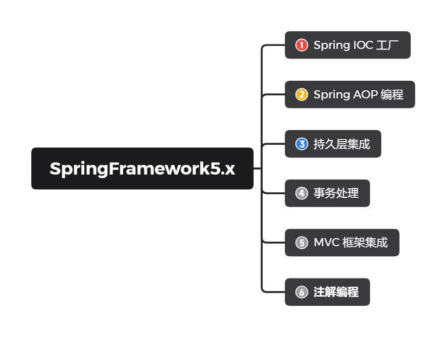

## 一、引言

### 1）EJB存在的问题

> ==EJB（Enterprise Java Bean）==存在的问题：
>
> - 运行环境苛刻（需要EJB容器）
> - 代码移植性差（服务器改变，代码相应需要改变）
>
> 总结：重量级框架

### 2）Web应用服务器

> Web应用服务器：
>
> Tomcat -> WebServer 包含Servlet引擎
>
> Weblogic(Oracle) -> ApplicationServer 包含Servlet引擎以及EJB容器
>
> Websphere(IBM) -> ApplicationServer 包含Servlet引擎以及EJB容器

### 3）什么是Spring

> ==Spring==是一个轻量级的JavaEE解决方案，整合了众多优秀的设计模式。
>
> - 轻量级
>   - 对于运行环境没有额外要求
>     - 开源：tomcat、resin、jetty
>     - 收费：Weblogic、Websphere
>   - 代码移植性高
>     - 不需要实现额外的接口
> - JavaEE的解决方案：解决Java开发过程中每一层次的问题（Controller、Service、DAO层等）
>
> 整合设计模式
>
> - 工厂、代理、模板、策略等设计模式

### 4）设计模式

> 广义：面向对象设计中，解决特定问题的经典代码
>
> 狭义：23种设计模式

#### 工厂设计模式

1. 什么是工厂设计模式

   > 1、概念：通过工厂类，创建对象
   >
   > 2、好处：解耦合
   >
   > ```Java
   > // 使用new创建对象，会造成代码的紧耦合
   > User user = new User();
   > UserDAO userDAO = new UserDAO();
   > ```
   >
   > ​	耦合：指的是代码间的强关联关系，一方的改变会影响另一方
   >
   > ​	问题：不利于代码维护
   >
   > ```Java
   > // 耦合可以简单理解如下这种把接口的实现类，硬编码在程序中
   > IUserService userService = new UserServiceImpl();
   > ```

2. 简单工厂设计

```Java
import java.io.IOException;
import java.io.InputStream;
import java.util.Properties;

/*  
applicationContext.properties
	# Properties 集合 存储文件内容
	# 特殊 Map<String, String>

	userService = UserServiceImpl
	userDAO = UserDAOImpl
*/

public class BeanFactory {

    private static Properties env = new Properties();

    static {
        try {
            // 1. 获得IO的输入流
            InputStream inputStream = BeanFactory.class.getResourceAsStream("./resources/applicationContext.properties");
            // 2. 文件内容封装到Properties集合中
            env.load(inputStream);

            inputStream.close();
        } catch (IOException e) {
            e.printStackTrace();
        }
    }

    /*
        对象的创建方式：
            1. 直接调用构造方法，创建对象 IUserService userService = new UserServiceImpl();
            2. 通过反射的形式 创建对象 解耦合
                Class clazz = Class.forName("");
                IUserService userService = (IUserService) clazz.newInstance();
     */
    public static IUserService getUserService(){
        IUserService userService = null;
        try {
            Class clazz = Class.forName(env.getProperty("userService"));
            userService = (IUserService) clazz.newInstance();
        } catch (ClassNotFoundException e) {
            e.printStackTrace();
        } catch (IllegalAccessException e) {
            e.printStackTrace();
        } catch (InstantiationException e) {
            e.printStackTrace();
        }

        return userService;
    }

    public static IUserDAO getUserDAO(){
        IUserDAO userDAO = null;
        try {
            Class clazz = Class.forName(env.getProperty("userDAO"));
            userDAO = (IUserDAO) clazz.newInstance();
        } catch (ClassNotFoundException e) {
            e.printStackTrace();
        } catch (IllegalAccessException e) {
            e.printStackTrace();
        } catch (InstantiationException e) {
            e.printStackTrace();
        }

        return userDAO;
    }
}

```

3. 通用工厂的设计

```Java
    /*
    	问题：简单工厂会存在大量的代码冗余，针对每个类型都要写一个类似方法
        key：配置文件中的 key {userDAO, userService}
     */
    public static Object getBean(String key){
        Object ret = null;
        try {
            Class clazz = Class.forName(env.getProperty(key));
            ret = clazz.newInstance();
        } catch (Exception e) {
            e.printStackTrace();
        }
        return ret;
    }
```

4. 通用工厂的使用方式

   > - 定义类型（类）
   > - 通过配置文件的配置告知工厂（applicationContext.properties）
   >   - key = value
   > - 通过工厂获得类的对象
   >   - Object ret = BeanFactory.getBean(key);

**Spring本质：工厂 ApplicationContext（辅以配置文件applicationContext.xml）**

