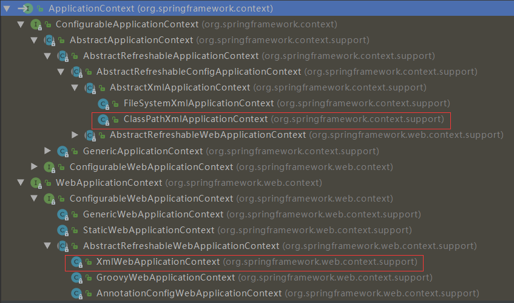
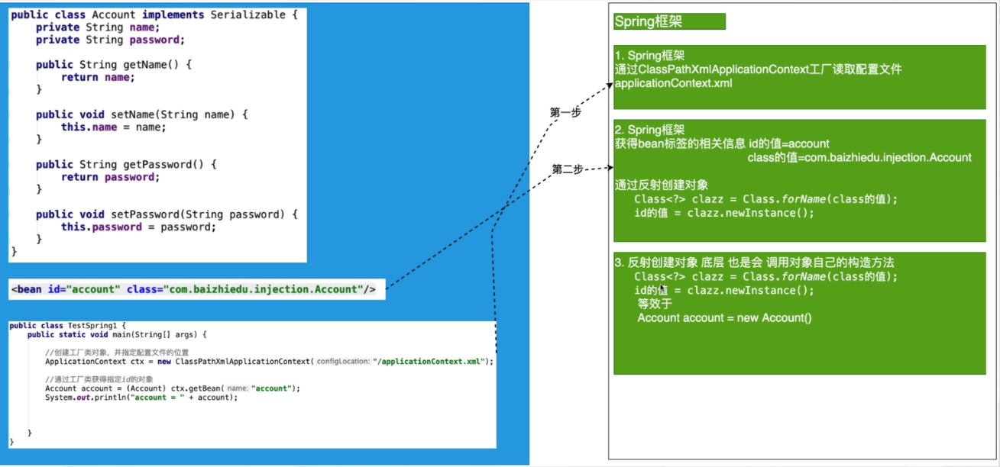

## 二、第一个Spring程序

### 1）软件版本

> - JDK 1.8+
>
> - Maven 3.5+
>   - 官网 http://maven.apache.org/
>   - 仓库 https://mvnrepository.com/
>
> - IDEA 2018+
>
> - SpringFramework 5.1.4
>   - 官网  www.spring.io

### 2）环境搭建

> - Spring的jar包
>   - 设置pom依赖
>
> ```xml
> <!-- https://mvnrepository.com/artifact/org.springframework/spring-context -->
> <dependency>
>     <groupId>org.springframework</groupId>
>     <artifactId>spring-context</artifactId>
>     <version>5.1.4.RELEASE</version>
> </dependency>
> ```
>
> - Spring的配置文件
>   -  配置文件的放置位置：任意位置，没有硬性要求
>   - 配置文件的命名：没有硬性要求，建议applicationContext.xml
>
> 思考：日后应用Spring框架时，需要进行配置文件路径的设置

### 3）Spring的核心API

- ApplicationContext
  - 作用：Spring提供的ApplicationContext这个工厂，用于对象的创建
  - 好处：解耦合
  - 接口类型
    - 接口：屏蔽实现的差异
    - 非web环境工厂实现：ClassPathXmlApplicationContext（main junit）
    - web环境工厂实现：XmlWebApplicationContext
  - 重量级资源
    - ApplicationContext工厂的对象占用大量内存。
    - 不会频繁的创建对象：一个应用只会创建一个工厂对象。
    - ApplicationContext工厂一定是线程安全的（可多线程并发访问）。



### 4）程序开发

> 1. 创建类型
> 2. 配置文件的配置    ApplicationContext.xml
>
> ```xml
> <!--id属性：名字（唯一）-->
> <!--class属性：配置全限定名-->
> <bean id="person" class="com.yhc.first.Person"/>
> ```
>
> 3. 通过工厂类获得对象
>
> - ApplicationContext
>   - ClassPathXmlApplicationContext
>   - XmlWebApplicationContext
>
> ```Java
> // 获得Spring工厂
> ApplicationContext ctx = 
>     new ClassPathXmlApplicationContext("/applicationContext.xml");
> // 通过工厂类 获得对象
> Person person = (Person) ctx.getBean("person");
> System.out.println("person = " + person);
> ```

### 5）细节分析

- 名词解释
  - Spring工厂创建的对象，叫做bean或者组件（componet）

- Spring相关方法

```Java
// 获得Spring工厂
ApplicationContext ctx = new ClassPathXmlApplicationContext("/applicationContext.xml");

// 1.通过工厂类 获得对象，不需要强制类型转换
Person person = ctx.getBean("person", Person.class);
System.out.println("person = " + person);

// 2.配置文件中只能有一个bean标签class属性为Person类型
// 否则抛出NoUniqueBeanDefinitionException异常
Person person = ctx.getBean(Person.class);

// 3.获取Spring工厂配置文件中所有bean标签的id值
String[] beanDefinitionNames = ctx.getBeanDefinitionNames();
for (String name : beanDefinitionNames)
System.out.println("beanDefinitionNames=" + name);

// 4.根据类型获取Spring工厂配置文件对应的id值
String[] beanNamesForType = ctx.getBeanNamesForType(Person.class);
for (String name : beanNamesForType)
	System.out.println("beanDefinitionNames=" + name);

// 5.用于判断是否存在指定id值的bean，不能判断name属性
if (ctx.containsBeanDefinition("user1")) {
	System.out.println("true");
}else{
	System.out.println("false");
}

// 6.用于判断是否存在指定id值的bean，也可以判断name属性
if (ctx.containsBean("person")) {
    System.out.println("true");
}else{
    System.out.println("false");
}
```

- 配置文件中需要注意的细节

  - 只配置class属性也可以

    ```xml
    <bean class="com.yhc.first.User"/>
    <!--
    	上述这种配置方式有id值，默认生成id值为 com.yhc.first.User#0
    	全限定名#第几个无id值的bean
    	应用场景：如果这个bean只需要使用一次，那么就可以省略id值
    			如果这个bean会使用多次，或者被其他bean应用则需要设置id值
    -->
    ```

  - name属性

    - 作用：用于在Spring的配置文件中，为bean对象定义别名（小名）

    - 与id属性相同

      - ctx.getBean("id|name") -> object

      - <bean id="person" class="com.yhc.first.Person"/>

        与 <bean name="person" class="com.yhc.first.Person"/> 等效

    - 不同
      - 别名可以定义多个，但id属性只能有一个值
      - XML的id属性的值，命名要求：必须以字母开头，后可接字母、数字、下划线、连字符，不能以特殊字符开头；name属性的值，命名没有要求，可以应用在特殊命名的场景下：/person
      - Tips：XML发展到了今天：id属性的限制，不存在，可以用/person命名
    - 代码
      - containsBeanDefinition() 用于判断是否存在指定id值的bean，不能判断name属性
      - containsBean() 用于判断是否存在指定id值的bean，也可以判断name属性

### 6）Spring工厂的底层实现原理（简易版）

**Spring工厂可以调用对象私有的构造方法创建对象**



### 7）思考

> 问题：未来在开发过程中，是不是所有的对象，都会交给Spring工厂来创建呢？
>
> 回答：理论上，是的，但是有特例：实体对象（entity）是不会交给Spring创建，而是由持久层框架进行创建。