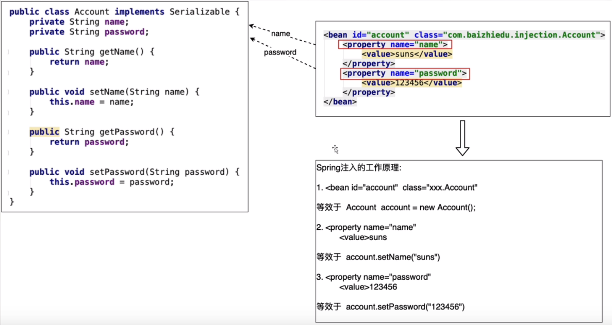

## 四、注入（Injection）

### 1）什么是注入

> 通过Spring工厂及配置文件，为所创建对象的成员变量赋值

#### 1.1）为什么需要注入

```Java
/*
    用于测试注入
    通过编码的方式，为成员变量进行赋值，存在耦合
 */
@Test
public void test6(){
    ApplicationContext ctx = 
        new ClassPathXmlApplicationContext("/applicationContext.xml") ;
    Person person = (Person)ctx.getBean("person");

    person.setId(1);
    person.setName("yhc");

    System.out.println("person = " + person);
}
```

#### 1.2）如何进行注入（开发步骤）

- 类为成员变量提供set、get方法

- 配置spring的配置文件

  ```xml
  <bean name="p, p1" id="person" class="com.yhc.example.Person">
      <property name="id">
          <value>10</value>
      </property>
      <property name="name">
          <value>xiaojr</value>
      </property>
  </bean>
  ```

#### 1.3）注入的好处

**解耦合**

### 2）Spring Set注入的原理分析（简易版）

**Spring通过底层调用对象属性对应的set方法，完成成员变量的复制，这种方式也称之为set注入**

