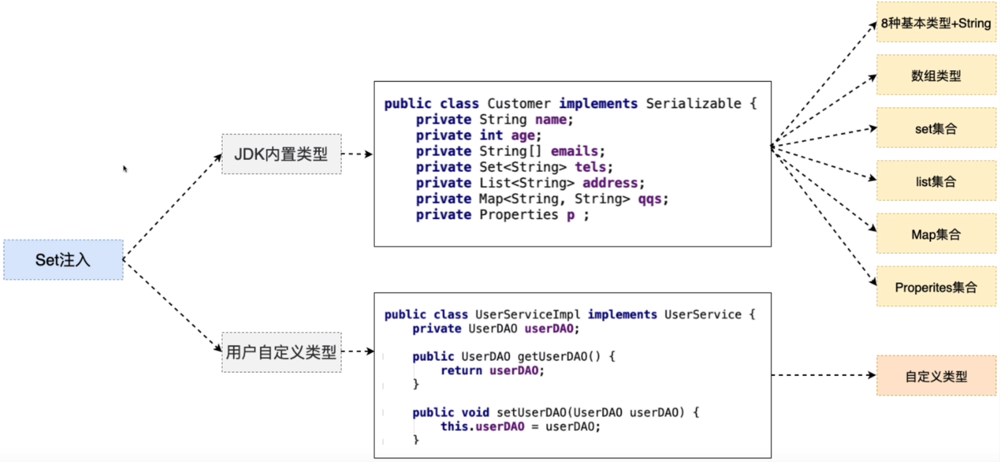

## 五、Set注入详解

> 针对于不同类型的成员变量，在<property></property>标签，需要嵌套其他标签的类型



### 1）JDK内置类型

#### 1.1）8种基本类型+String

```xml
<value>xxxxxx</value>
```

#### 1.2）数组类型

```xml
<list>
    <value>xxxxxx</value>
    <value>xxxxxx</value>
</list>
```

#### 1.3）Set集合

```xml
<set>
    <value>xxxxxx</value>
    <value>xxxxxx</value>
    <value>xxxxxx</value>
</set>
```

#### 1.4）List集合

```xml
<list>
    <value>xxxxxx</value>
    <value>xxxxxx</value>
    <value>xxxxxx</value>
</list>
```

#### 1.5）Map集合

```xml
<!--
	Tips: map -> entry -> key有特定标签 
					   -> 值根据对应类型选择
-->
<map>
    <entry>
        <key><value>xxxxxx</value></key>
        <value>xxxxxx</value>
    </entry>
    <entry>
        <key><ref bean="">xxx</ref></key>
        <ref bean="">xxx</ref>
    </entry>
</map>
```

#### 1.6）Properites集合

**Properties类型：特殊的Map key=String value=String**

```xml
<props>
    <prop key="key1">value1</prop>
    <prop key="key2">value2</prop>
</props>
```

#### 1.7）复杂的JDK类型（Date）

需要程序员自定义类型转换器处理。

### 2）用户自定义类型

#### 2.1）第一种方式

- 为成员变量提供set get方法
- 配置文件中进行注入（赋值）

```xml
<bean id="userService" class="com.yhc.example.UserServiceImpl">
    <property name="userDAO">
        <bean class="com.yhc.example.UserDAOImpl"/>
    </property>
</bean>
```

#### 2.2）第二种方式

> 第一种方式存在问题：
>
> - 配置文件代码冗余
> - 被注入的对象（UserDAO），多次创建，浪费（JVM）内存资源

- 为成员变量提供set get方法

- 配置文件中进行配置

```xml
<bean id="userDAO" class="com.yhc.example.UserDAOImpl"/>

<bean id="userService" class="com.yhc.example.UserServiceImpl">
    <property name="userDAO">
        <ref bean="userDAO"/>
    </property>
</bean>

<bean id="orderService" class="com.yhc.example.OrderServiceImpl">
    <property name="userDAO">
        <ref bean="userDAO" />
    </property>
</bean>

# Spring4.x 废除了 <ref local=""/> 与 <ref bean="" /> 基本等效 
<ref local=""/> 只能引用本配置文件中的bean对象
<ref bean="" /> 可以引用本配置文件的，还可以引用父容器的bean对象
```

### 3）Set注入的简化写法

#### 3.1）基于属性简化

```xml
JDK类型注入
<property name="name">
	<value>yhc</value>
</property>
=>
<property name="name" value="yhc"/>
Tips：通过value属性，只能简化8种基本类型+String注入的标签

用户自定义类型
<property name="userDAO">
    <ref bean="userDAO" />
</property>
=>
<property name="userDAO" ref="userDAO"/>
```

#### 3.2）基于p命名空间简化

```xml
JDK类型注入
<bean id="person" class="com.yhc.example.Person">
    <property name="name">
		<value>yhc</value>
	</property>
</bean>
=>
<bean id="person" class="com.yhc.example.Person" p:name="yhc"/>
Tips：通过value属性，只能简化8种基本类型+String注入的标签

用户自定义类型
<bean id="userService" class="com.yhc.example.UserServiceImpl">
    <property name="userDAO">
        <ref bean="userDAO" />
    </property>
</bean>
=>
<bean id="userService" class="com.yhc.example.UserServiceImpl" 
      p:userDAO-ref="userDAO"/>
```

