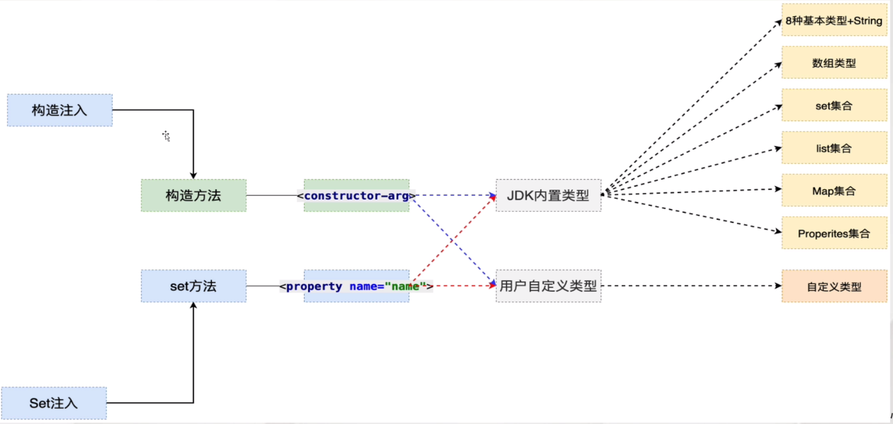

## 六、构造注入

> 注入：通过Spring的配置文件，为成员变量赋值
>
> Set注入：Spring调用Set方法，通过配置文件，为成员变量赋值
>
> 构造注入：Spring调用构造方法，通过配置文件，为成员变量赋值

### 1）开发步骤

- 提供有参构造方法

  ```Java
  public class Customer implements Serializable {
  
      private String name;
      private int age;
  
      public Customer(String name, int age) {
          this.name = name;
          this.age = age;
      }
  
  }
  ```

- 配置Spring的配置文件

    ```xml
    <bean id="customer" class="com.yhc.example.constructor.Customer">
        <constructor-arg>
            <value>yhc</value>
        </constructor-arg>
        <constructor-arg>
            <value>22</value>
        </constructor-arg>
    </bean>
    ```

### 2）构造方法重载

#### 2.1）参数个数不同时

```xml
<!--通过控制constructor-arg数量区分-->
```

#### 2.2）构造参数个数相同，参数类型不同时

```xml
<!--通过在标签引入type属性加以区分-->
<constructor-arg type="int">
```

### 3）注入的总结

> Set注入 构造注入，如何选择？
>
> 答案：set注入更多
>
> 				1. 构造注入麻烦（重载）
>    				2. Spring框架底层 大量应用了 Set注入

