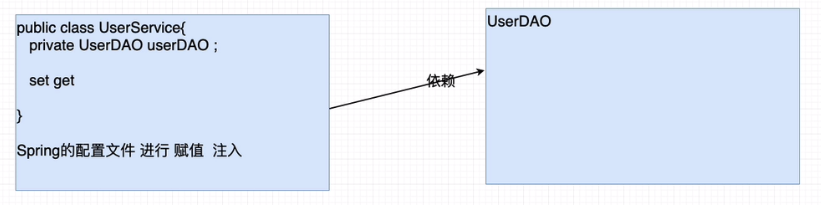

## 七、控制反转与依赖注入

### 1）反转（转移）控制（IOC Inverse of Control）

> 控制：对于成员变量赋值的控制权
>
> 反转控制：把对于成员变量赋值的控制权，从代码中反转（转移）到Spring工厂和配置文件中完成
>
> - 好处：解耦合
> - 底层实现：工厂设计模式

### 2）依赖注入（DI Dependency Injection）

> 注入：通过Spring的工厂及配置文件，为对象（bean，组件）的成员变量赋值
>
> 依赖注入：当一个类需要另一个类时，就意味着依赖，一旦出现依赖，就可以把另一个类作为本类的成员变量，最终通过Spring配置文件进行注入（赋值）。
>
> - 好处：解耦合

