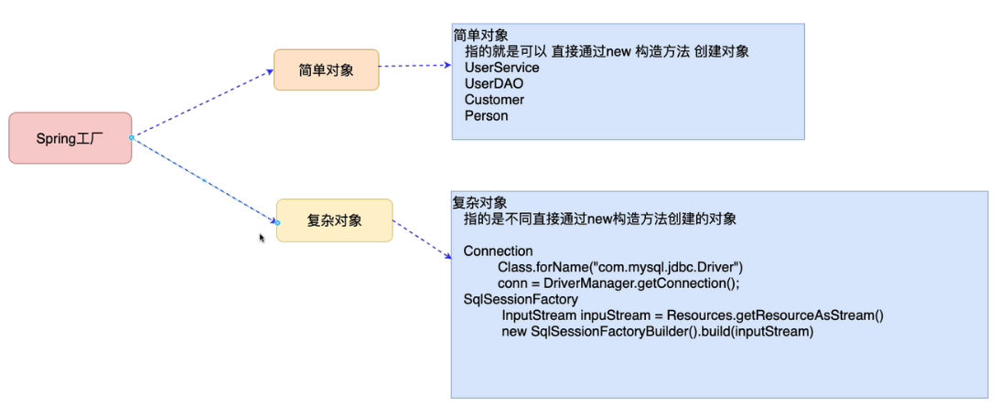
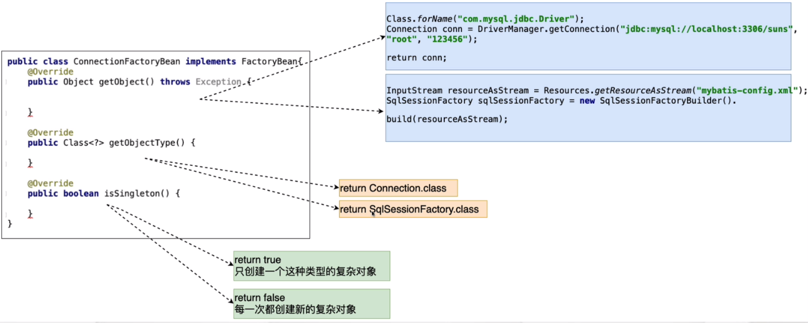
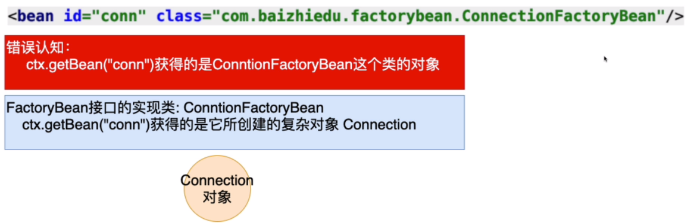
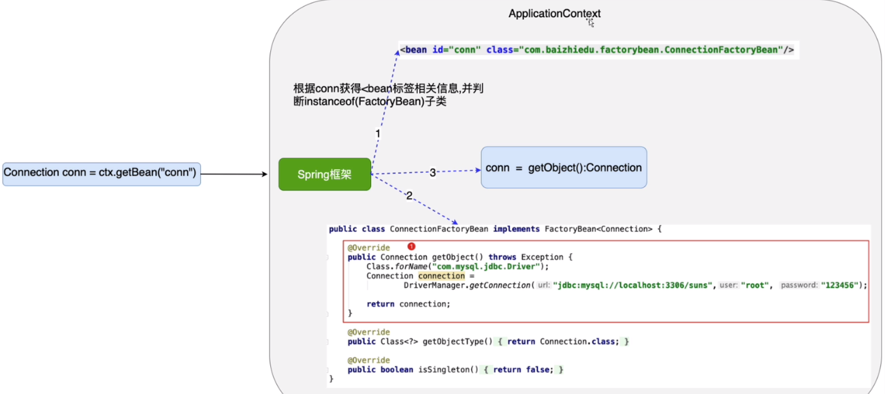
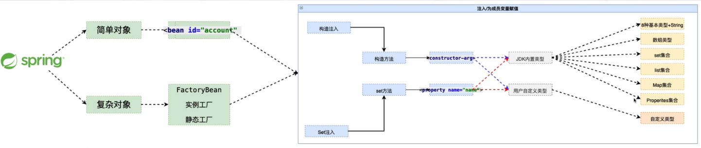

## 八、Spring创建复杂对象

### 1）什么是复杂对象



> 复杂对象：指的是不能直接通过new构造方法创建的对象
>
> ​		Connection
>
> ​		SqlSessionFactory

### 2）Spring工厂创建复杂对象的3种方式

#### 2.1）FactoryBean接口

1. 开发步骤
   - 实现FactoryBean接口



- Spring配置文件的配置

```xml
<!--如果Class中指定的类型是FactoryBean接口的实现类，那么通过id值获得的是这个类所创建的复杂对象 Connection-->
<bean id="conn" class="com.yhc.factorybean.ConnectionFactoryBean"/>
```



2. 细节

- 如果想获得FactoryBean类型的对象 ctx.getBean("&conn") 获得的就是ConnectionFactoryBean对象

- isSingleton 方法：返回true只会创建一个复杂对象，返回false每一次都会创建一个新的对象

  - 根据对象的特点，决定是返回true（SqlSessionFactory）还是false（connection）

- MySQL高版本在进行连接创建时，需要指定SSL证书，解决问题的方式

  ```Java
  url = "jdbc:mysql://localhost:3306/yhc?useSSL=false"
  ```

- 依赖注入

  - 把ConnectionFactoryBean中依赖的4个字符串信息，进行配置文件的注入
  - 好处：解耦合

  ```xml
  <bean id="conn" class="com.yhc.factorybean.ConnectionFactoryBean">
      <property name="driverClassName" value="com.mysql.jdbc.Driver"/>
      <property name="url" value="jdbc:mysql://localhost:3306/yhc?useSSL=false"/>
      <property name="username" value="root"/>
      <property name="password" value="476004"/>
  </bean>
  ```

3. FactoryBean的实现原理（简易版）
   - 为什么Spring规定FactoryBean接口，并且将创建实现复杂对象的方法写在getObject()方法中？
   - ctx.getBean("conn") 获得的是复杂对象Connection而没有获得ConnectionFactoryBean（&）
   - 接口回调

```markdown
Spring内部运行流程
1. 通过id获得class对象（通过conn获得ConnectionFactoryBean对象），进而通过instanceof判断出是否是FacotryBean接口的实现类
2. Spring按照规定调用getObject() -> 创建出Connection对象
3. 返回Connection
```



4. FactoryBean总结
   - FactoryBean是Spring原生提供的用于创建复杂对象的一种方式，整合其他框架时会大量应用FactoryBean。

#### 2.2）实例工厂

- 优势
  - 避免Spring框架的侵入
    - FactoryBean接口创建复杂对象会有Spring框架的侵入
  - 整合遗留系统

- 开发步骤

```xml
<bean id="connFactory" class="com.yhc.factorybean.ConnectionFactory"/>
<bean id="conn" factory-bean="connFactory" factory-method="getConnection"/>
```

#### 2.3）静态工厂

- 与实例工厂的区别：静态工厂创建对象的方法是静态方法，实例工厂创建对象的方法是实例方法。

```xml
<bean id="conn" class="com.yhc.factorybean.StaticConnectionFactory" factory-method="getConnection"/>
```

### 3）Spring工厂创建对象总结

