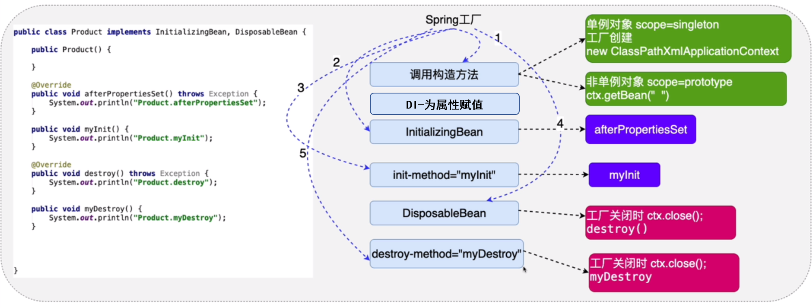

## 十、对象的生命周期



### 1）什么是对象的生命周期

> 指的是一个对象创建、存活、销毁的一个完整过程。

### 2）为什么要学习对象的生命周期

> before: User user = new User(); -> JVM GC
>
> now: 由Spring负责对象的创建、存活、销毁，了解生命周期，有利于我们使用好Spring为我们创建的对象。

### 3）生命周期的3个阶段

- 创建阶段

  - scope = "singleton"
    - Spring工厂创建的同时，创建对象
    - 添加属性 lazy-init="true" -> Spring工厂会在获取对象的同时，创建对象
  - scope = "prototype"
    - Spring工厂会在获取对象的同时，创建对象
    - ctx.getBean("")

- 初始化阶段

  > Spring工厂在创建完对象后，调用对象的初始化方法，完成对应的初始化操作
  >
  > - 初始化方法提供：程序员根据需求，提供初始化方法，最终完成初始化操作
  > - 初始化方法调用：Spring工厂进行调用

  - 实现InitializingBean接口的afterPropertiesSet方法

    ```java
    // 初始化方法
    @Override
    public void afterPropertiesSet() throws Exception {
        
    }
    ```

  - 对象中提供一个普通的初始化方法，通过配置文件配置

    ```java
    public void myInit(){
        
    }
    
    // 配置文件
    <bean id="xx" class="xxxxx.xxxxx.xxx" init-method="myInit"/>
    ```

  - 细节分析

    1. Spring先进行属性的注入，再进行初始化

    2. 如果一个对象既实现InitializingBean接口，同时又提供了普通的初始化方法，调用顺序为先接口的afterPropertiesSet方法，后普通初始化方法

    3. 什么叫做初始化操作

       ```markdown
       资源的初始化：数据库、IO、网络 ……
       ```

- 销毁阶段

  > Spring销毁对象前，会调用对象的销毁方法，完成销毁操作
  >
  > 1. Spring什么时候销毁所创建的对象？
  >
  >    工厂关闭的时候，ctx.close();
  >
  > 2. 销毁方法：程序员根据自己的需求，定义销毁方法，完成销毁操作
  > 3. 销毁调用：Spring工厂完成调用
  - 实现DisposableBean接口的destroy方法

    ```java
    @Override
    public void destroy() throws Exception {
    
    }
    ```

  - 对象中提供一个普通的销毁方法，通过配置文件配置

    ```java
    public void myDestory(){
        
    }
    
    // 配置文件
    <bean id="xx" class="xxxxx.xxxxx.xxx" init-method="myDestory"/>
    ```

  - 细节分析

    1. 销毁方法的操作只使用于scope="singleton"的对象

    2. 如果一个对象既实现DisposableBean接口，同时又提供了普通的销毁方法，调用顺序为先接口的destroy方法，后普通初始化方法

    3. 什么叫做销毁操作

       ```markdown
       资源的释放：io.close()  connection.close()  xxx.release()
       ```

