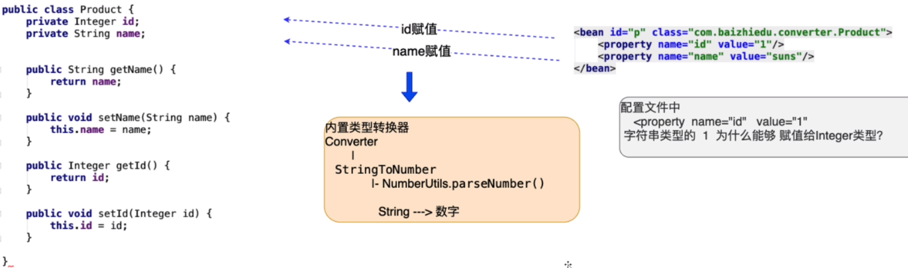

## 十二、自定义类型转换器

### 1）类型转换器

> 作用：Spring通过类型转换器把配置文件中字符串类型的数据，转换成了对象中成员变量对应类型的数据，进而完成了注入。



### 2）自定义类型转换器

> ```Java
> public class Person {
>     private String name;
>     private Date birthday;
> 
>     public String getName() {
>         return name;
>     }
> 
>     public void setName(String name) {
>         this.name = name;
>     }
> 
>     public Date getBirthday() {
>         return birthday;
>     }
> 
>     public void setBirthday(Date birthday) {
>         this.birthday = birthday;
>     }
> }
> 
> // xml
> <bean id="person" class="com.yhc.converter.Person">
>     <property name="name" value="yhc"/>
>     <property name="birthday" value="1997-09-30"/>
> </bean>
> ```
>
> - Cannot convert value of type 'java.lang.String' to required type 'java.util.Date' for property 'birthday'
>   - IllegalStateException
>   - ConversionNotSupportedException
>   - BeanCreationException
>
> 产生原因：当Spring内部没有提供特定类型转换器时，而程序员在应用的过程中还需要使用，那么就需要程序员自己定义类型转换器。

- 开发步骤

  - 实现converter接口

  ```Java
  public class MyDateConverter implements Converter<String, Date> {
  
      // convert方法作用: String -> Date
      // Date date = SimpleDateFormat.parse(s)
      // param: 配置文件中，日期字符串 <value>1997-09-30</value>
      // return: 当把转换好的Date作为convert方法的返回值后，Spring自动的为birthday属性进行注入(赋值)
      @Override
      public Date convert(String s) {
          Date date = null;
          try {
              SimpleDateFormat sdf = new SimpleDateFormat("yyyy-MM-dd");
              date = sdf.parse(s);
          } catch (ParseException e) {
              e.printStackTrace();
          }
          return date;
      }
  }
  ```

  - Spring配置文件进行配置
    - 创建MyDateConverter对象
    - 类型转换器的注册（目的：告知Spring框架，我们所创建的MyDateConverter是一个类型转换器）

  ```xml
  <!--bean标签的书写顺序与工厂创建对象的顺序无关-->
  <bean id="dateConverter" class="com.yhc.converter.MyDateConverter"/>
  
  <!--用于注册类型转换器 id固定不能变动-->
  <bean id="conversionService" class="org.springframework.context.support.ConversionServiceFactoryBean">
      <property name="converters">
          <set>
              <ref bean="dateConverter"/>
          </set>
      </property>
  </bean>
  ```

### 3）细节

- 把MyDateConverter中的日期的格式，通过依赖注入方式，通过配置文件来完成

```Java
public class MyDateConverter implements Converter<String, Date> {

    private String pattern;

    public String getPattern() {
        return pattern;
    }

    public void setPattern(String pattern) {
        this.pattern = pattern;
    }

    // convert方法作用: String -> Date
    // Date date = SimpleDateFormat.parse(s)
    // param: 配置文件中，日期字符串 <value>1997-09-30</value>
    // return: 当把转换好的Date作为convert方法的返回值后，Spring自动的为birthday属性进行注入(赋值)
    @Override
    public Date convert(String s) {
        Date date = null;
        try {
            SimpleDateFormat sdf = new SimpleDateFormat(pattern);
            date = sdf.parse(s);
        } catch (ParseException e) {
            e.printStackTrace();
        }
        return date;
    }
}
```

```xml
<bean id="dateConverter" class="com.yhc.converter.MyDateConverter" p:pattern="yyyy-MM-dd"/>
```

- 用于注册类型转换器，ConversionServiceFactoryBean定义id属性值必须为conversionService
- Spring框架内置日期类型的转换器
  - 日期格式：2020/07/25