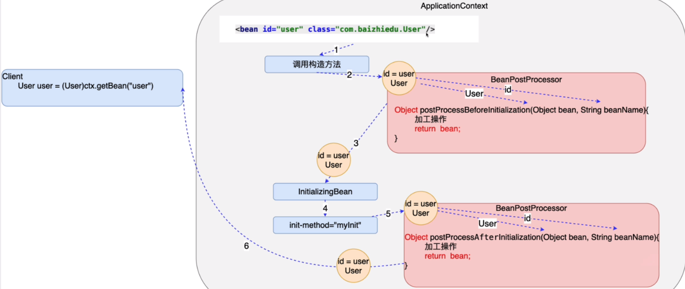

## 十三、后置处理Bean

> BeanPostProcessor作用：对Spring工厂所创建的对象，进行在加工
>
> AOP底层实现基础
>
> 注意：实现BeanPostProcess接口
>
> - Object postProcessBeforeInitialization(Object bean, String beanName)
>   - 作用：Spring创建完对象，并进行注入后，可以进行Before进行加工
>   - 获得Spring创建好的对象：通过方法参数
>   - 最终通过返回值交给Spring框架
> - Object postProcessAfterInitialization(Object bean, String beanName)
>   - 作用：Spring执行完对象的初始化操作后，可以进行After进行加工
>   - 获得Spring创建好的对象：通过方法参数
>   - 最终通过返回值交给Spring框架
>
> 实战中：很少处理Spring的初始化操作，没有必要区分Before  After，只需要实现其中的一个方法即可，但在Before中一定要返回bean对象



- BeanPostProcessor的开发步骤

  - 类 实现 BeanPostProcessor接口

  ```java
  public class MyBeanPostProcessor implements BeanPostProcessor {
      // BeanPostProcessor接口带有默认实现
      // default关键字
  
  
      @Override
      public Object postProcessBeforeInitialization(Object bean, String beanName) throws BeansException {
          return null;
      }
  
      @Override
      public Object postProcessAfterInitialization(Object bean, String beanName) throws BeansException {
          Categroy c = (Categroy) bean;
          c.setName("xiaowb");
          return c;
      }
  }
  ```

  - Spring的配置文件中进行配置

  ```xml
  <bean id="myBeanPostProcessor" class="com.yhc.beanpost.MyBeanPostProcessor"/>
  ```

  - BeanPostProcessor会对工厂创建的所有的对象进行加工

  ```Java
      @Override
      public Object postProcessAfterInitialization(Object bean, String beanName) throws BeansException {
          // 做一个保护处理
          if (bean instanceof Categroy) {
              Categroy c = (Categroy) bean;
              c.setName("xiaowb");
          }
          return bean;
      }
  ```

  