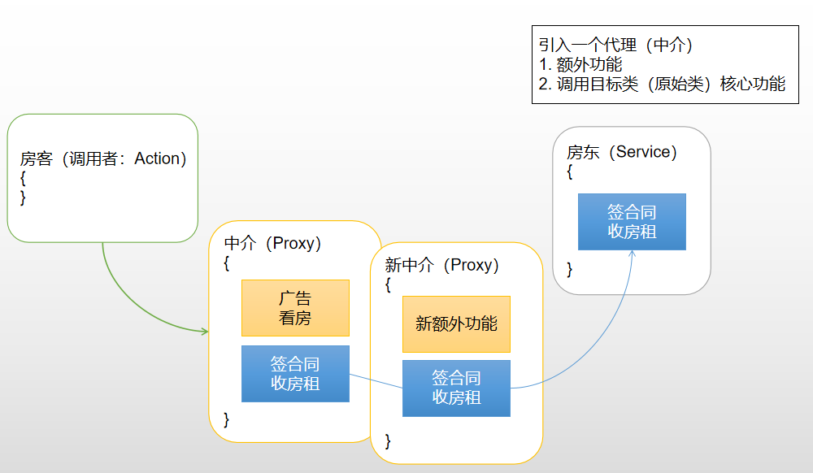
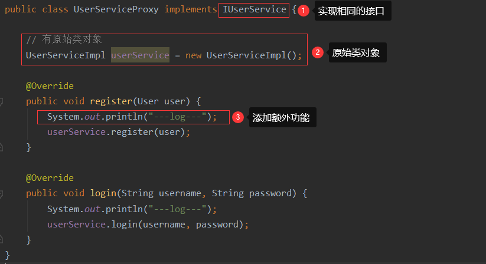

## 十四、静态代理设计模式

### 1）为什么需要代理设计模式

> 1. 在JavaEE分层开发过程中，哪个层次对于我们来说最重要？
>
>    DAO -> `Service` -> Controller
>
> 2. Service层中都包含了哪些代码？
>
>    附加功能：事务、日志、性能……  ->  不属于核心业务、可有可无、代码量少
>
>    - 日志：记录用户重要操作的流水账  ->  谁+时间+什么事+结果
>    - 性能：begin-time -> 核心业务 -> end-time  =>  end - begin
>
>    核心业务：业务运算 + DAO操作  ->  几十、上百行代码
>
> 3. 附加功能书写在Service层中好不好？
>
>    - Service层的调用者的角度（Controller）：需要在Service层中书写额外功能（事务）
>    - 软件设计者的角度：Service层中不需要额外功能，不需要这些代码时需要修改代码删除
>
>    `产生冲突，如何解决？`
>
> 4. 现实生活中的解决方式
>
>     

### 2）代理设计模式

> 1. 概念：通过代理类，为原始类（目标类）增加额外的功能
> 2. 好处：利于原始类（目标类）的维护

> 名词解释：
>
> - 原始类（目标类）：业务类（核心功能  -->  业务运算+DAO调用）
> - 原始方法（目标方法）：原始类（目标类）中的方法
> - 额外功能（附加功能）：以日志、性能、事务为代表

> 代理开发的核心要素
>
> - 代理类 = 目标类（原始类） + 额外功能 + 代理类与目标类（原始类）实现相同的接口

### 3）代理设计模式的实现

> 静态代理：为每一个原始类，手工编写一个代理类（.java .class）

### 4）静态代理存在的问题

> 1. 静态代理类文件数量过多，不利于项目管理
>
>    UseServiceImpl -> UserServiceProxy
>
>    OrderServiceImpl -> OrderServiceProxy
>
> 2. 静态代理维护性差
>
>    代理类中，额外功能修改复杂