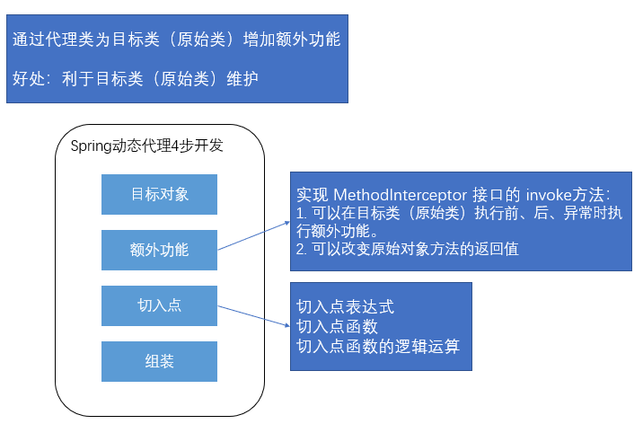
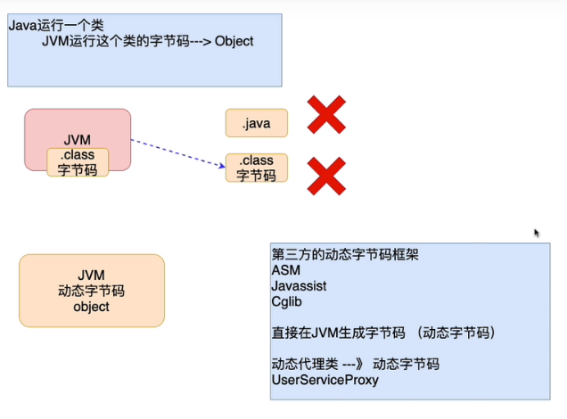

## 十五、Spring的动态代理开发



### 1）Spring动态代理的概念

>- 概念：通过代理类为原始类（目标类）增加额外功能
>- 好处：利于原始类（目标类）的维护

### 2）搭建开发环境

```xml
<!-- https://mvnrepository.com/artifact/org.springframework/spring-aop -->
<dependency>
    <groupId>org.springframework</groupId>
    <artifactId>spring-aop</artifactId>
    <version>5.1.14.RELEASE</version>
</dependency>

<!-- https://mvnrepository.com/artifact/org.aspectj/aspectjweaver -->
<dependency>
    <groupId>org.aspectj</groupId>
    <artifactId>aspectjweaver</artifactId>
    <version>1.8.13</version>
</dependency>

<!-- https://mvnrepository.com/artifact/org.aspectj/aspectjrt -->
<dependency>
    <groupId>org.aspectj</groupId>
    <artifactId>aspectjrt</artifactId>
    <version>1.8.13</version>
</dependency>
```

### 3）Spring动态代理的开发步骤

1. 创建目标类（原始类）对象

   ```java
   public class UserServiceImpl implements IUserService {
       @Override
       public void register(User user) {
           System.out.println("UserServiceImpl.register");
       }
   
       @Override
       public void login(String username, String password) {
           System.out.println("UserServiceImpl.login");
       }
   }
   ```

   ```xml
   <bean id="userService" class="com.yhc.proxy.UserServiceImpl"/>
   ```

2. 提供额外功能

   > MethodBeforeAdvice接口
   >
   > - 额外功能书写在接口的实现中，运行在原始方法执行之前运行额外功能。

   ```java
   public class Before implements MethodBeforeAdvice {
   
       // 作用: 需要把运行在原始方法执行之前运行的额外功能，书写在before方法中
       @Override
       public void before(Method method, Object[] objects, Object o) throws Throwable {
           System.out.println("----method before advice log----");
       }
   }
   
   ```

   ```xml
   <bean id="before" class="com.yhc.dynamic.Before"/>
   ```

3. 定义切入点

   > 切入点：额外功能加入的位置
   >
   > 目的：由程序员根据自己的需求，决定额外功能加给那个原始方法
   >
   > 简单测试：所有方法都作为切入点，都加入额外功能

   ```xml
   <!--所有的方法，都作为切入点，加入额外功能-->
   <aop:config>
       <aop:pointcut id="pc" expression="execution(* *(..))"/>
   </aop:config>
   ```

4. 组装（2. 3.进行整合）

   ```xml
   <!--所有的方法，都作为切入点，加入额外功能-->
   <aop:config>
       <aop:pointcut id="pc" expression="execution(* *(..))"/>
   
       <!--组装: 目的把切入点 与 额外功能进行整合-->
       <aop:advisor advice-ref="before" pointcut-ref="pc"/>
   </aop:config>
   ```

5. 调用

   > 目的：获得Spring工厂创建的动态代理对象，并进行调用
   >
   > - 获取工厂：ApplicationContext ctx = new ClassPathXmlApplicationContext("/applicationContext.xml");
   >   - Spring的工厂通过原始对象的id值获得的是代理对象
   >   - 获得代理对象后，可以通过声明接口类型，来进行对象的存储 
   > - 获取工厂创建的代理对象：IUserService userService = (IUserService) ctx.getBean("userService");

### 4）动态代理细节分析

1. Spring创建的动态代理类在哪里？

   > Spring框架在运行时，通过动态字节码技术，在JVM创建的，运行在JVM内部，程序结束后，会和JVM一起消失。
   >
   > 什么是动态字节码技术？
   >
   > 
   >
   > - 通过第三方动态字节码框架，在JVM中创建对应类的字节码，进而创建对象，当虚拟机结束，动态字节码随之消失。
   >
   > 结论：动态代理不需要定义代理类文件，都是JVM运行过程中动态创建的，所以不会造成静态代理，类文件数量过多，不利于项目管理的问题。

2. 动态代理编程简化静态代理的开发

   > 在额外功能不改变的前提下，创建其他目标类（原始类）的代理对象时，只需要指定原始（目标）对象即可。

3. 动态代理额外功能的维护性大大增强