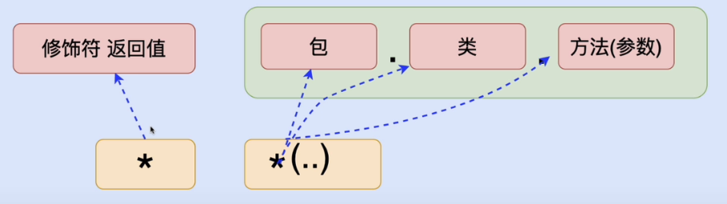

## 十六、Spring动态代理详解

### 1）额外功能详解

- MethodBeforeAdvice分析
  - MethodBeforeAdvice接口作用：额外功能运行在原始方法执行之前，进行额外功能操作。
  - before方法的3个参数在实战中，该如何使用
    - before方法的参数，在实战中，会根据需要进行使用，不一定都会用到，也有可能都不用

```java
public class Before implements MethodBeforeAdvice {

    /*
    	params:
            Method: 额外功能所增加给的那个原始方法
                    login方法
            Object[]: 额外功能所增加给的那个原始方法的参数
                    login方法接收的参数 String username, String password
            Object: 额外功能所增加给的那个原始对象
                    UserServiceImpl
     */

    @Override
    public void before(Method method, Object[] objects, Object o) throws Throwable {
        System.out.println("Before1.before");
    }
}
```

- MethodInterceptor（方法拦截器）
  - MethodInterceptor接口作用：额外功能运行在原始方法执行之前或之后，进行额外功能操作，也可以在原始功能抛出异常时进行异常捕获
  - 运行在原始方法执行之前、之后的额外功能：事务、性能
  - MethodInterceptor可以影响原始方法的返回值
    - 原始方法的返回值，直接作为invoke方法的返回值返回，MethodInterceptor不会影响原始方法的返回值
    - MethodInterceptor影响原始方法的返回值，invoke方法不返回原始方法的返回值

```java
public class Around implements MethodInterceptor {

    /*
        invoke方法的作用: 额外功能书写在invoke中
            可以 在原始方法之前
                 在原始方法之前
                 在原始方法之前、之后 执行额外功能
         params:
            MethodInvocation(Method): 额外功能所增加给的原始方法
         return:
            Object: 原始方法的返回值
     */

    @Override
    public Object invoke(MethodInvocation methodInvocation) throws Throwable {

        System.out.println("--before--");

        Object ret = null;
        try {
            // 原始方法运行
            ret = methodInvocation.proceed();
        } catch (Throwable throwable)
        {
            System.out.println("--exception--");
            throwable.printStackTrace();
        }

        System.out.println("--after--");

        return ret;
    }
}
```

### 2）切入点详解

> 切入点决定额外功能加入的位置（需要增加额外功能的方法）
>
> <aop:pointcut id="pc" expression="execution(* *(..))"/>     ----->     匹配了所有方法
>
> 1. execution() 切入点函数
> 2. `* *(..) ` 切入点表达式 

#### 2.1）方法切入点表达式

> 1. `* *(..)`  -->  所有方法
>
>    第一个*  ->  修饰符 返回值
>
>    第二个*  ->  方法名
>
>    ()  -->  参数表
>
>    ..  -->  对于参数没有要求（参数有没有，有几个，什么类型都行）
>
> Tips：使用非java.lang包中的类型，必须写全限定名
>
> ​			  .. 可以和具体的参数类型连用，如 `(String, ..)` 表示第一个参数为String类型，后面参数没有要求
>
> 2. 精准方法切入点限定
>
>    

### 2.2）类切入点表达式

> 指定特定的类作为切入点（额外功能加入的位置），类中所有方法均会加上对应的额外功能
>
> - 语法一
>
>   `* com.yhc.proxy.UserServiceImpl.*(..)`
>
> - 语法二：所有包中的UserServiceImpl类（一个`.`代表一层包，两个`.`代表任意层包）
>
>   `* *.UserServiceImpl.*(..)`
>
>   `* *..UserServiceImpl.*(..)`

### 2.3）包切入点表达式

> 指定特定的包作为切入点（额外功能加入的位置），包中所有类的所有方法均会加上对应的额外功能
>
> - 语法一：切入点包中的所有类，必须都在proxy包中，不能在proxy的子包中
>
>   `* com.yhc.proxy.*.*(..)`
>
> - 语法二：包括子包
>
>   `* com.yhc.proxy..*.*(..)`

### 2.4）切入点函数

> 切入点函数：用于执行切入点表达式
>
> - execution：最为重要的切入点函数，功能最全。可以执行方法、类、包切入点表达式
>   - 弊端：execution执行切入点表达式，书写冗长、麻烦
>   - 其他的切入点函数简化execution书写复杂度，功能上完全一致
> - args：主要用于函数（方法）参数的匹配
>   - 切入点：方法参数必须是2个字符串类型的参数
>     - `execution(* *(String, String))`
>     - `args(String, String)`
>
> - within：主要用于进行类、包切入点表达式的匹配
>   - 切入点：UserServiceImpl类
>     - `execution(* *..UserServiceImpl.*(..))`
>     - `within(*..UserServiceImpl)`
>   - 切入点：com.yhc.proxy包
>     - `execution(* com.yhc.proxy..*.*(..))`
>     - `within(com.yhc.proxy..*)`
>
> - @annotation：为具有特殊注解的方法加入额外功能
>   - `@annotation(注解的全限定名)`

### 2.5）切入点函数的逻辑运算

> 整合多个切入点函数一起配合工作，进而完成更为复杂的需求
>
> - and 与操作
>
>   ```java
>   案例：匹配 方法名为login 并且 参数为2个字符串 的方法
>   1. execution(* login(String, String))
>   2. execution(* login(..)) and args(String, String)
>   
>   注意：与操作不能用于同种类型的切入点函数 (execution and execution ×)
>   理由：不存在满足这种条件的函数
>   ```
>
> - or 或操作
>
>   ```java
>   案例：匹配 方法名为login 和 方法名为register作为切入点
>   1. execution(* login(..)) or execution(* register(..))
>   ```

