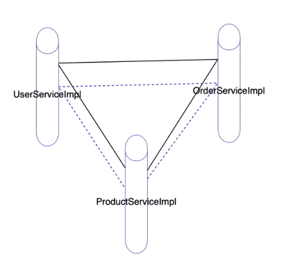

## 十七、AOP编程

> - AOP（Aspect Oriented Programing）面向切面编程 == Spring动态代理开发
>   - 以切面为基本单位的程序开发，通过切面间的彼此协同，相互调用，完成程序的构建
>   - 切面 = 切入点 + 额外功能
>
> - OOP（Object Oriented Programing）面向对象编程
>   - Java 以对象为基本单位的程序开发，通过对象间的彼此协同，相互调用，完成程序的构建
>
> - POP（Process Oriented Programing）面向过程（方法、函数）编程
>   - C语言 以过程为基本单位的程序开发，通过过程间的彼此协同，相互调用，完成程序的构建
>
> 注意：AOP编程不可能取代OOP，是OOP编程的有意补充。

### 1）AOP编程的开发步骤

1. 原始对象
2. 额外功能（实现MethodInterceptor接口）
3. 切入点
4. 组装切面（额外功能 + 切入点）

### 2）切面的名词解释

> 切面 = 切入点 + 额外功能
>
> 几何学：面 = 点 + 相同的性质
>
> 