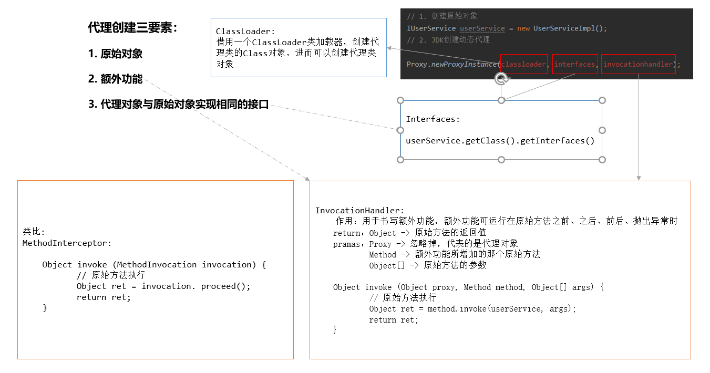
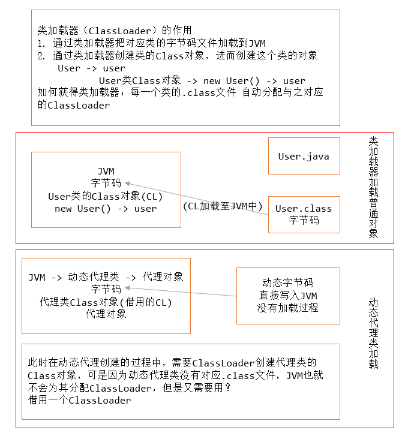
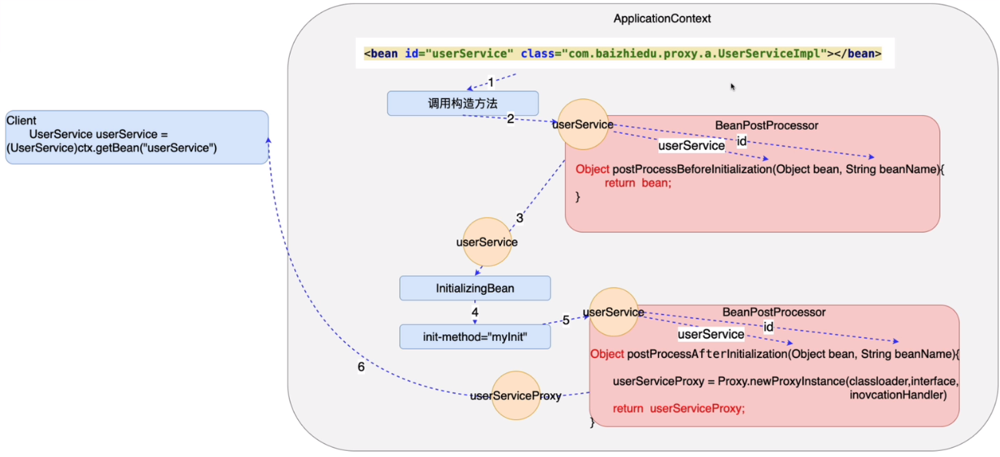

## 十八、AOP的底层实现原理

### 1）核心问题

> 1. AOP如何创建动态代理类（动态字节码技术）
> 2. Spring工厂如何加工创建代理对象
>    - 通过原始对象的id值，获得的是代理对象

### 2）动态代理类的创建

#### 2.1）JDK的动态代理

1. Proxy.newProxyInstance方法参数详解





2. 核心编码

```java
public class TestJDKProxy {
    /*
    	1. 任何类的加载器均可作为借用的类加载器
    	2. JDK 8.X 前 内部类访问外部类局部变量，需要将外部类的局部变量声明成final
    		final IUserService userService = new UserServiceImpl();
     */

    public static void main(String[] args) {
        // 1. 创建原始对象
        final IUserService userService = new UserServiceImpl();
        // 2. JDK创建动态代理
        InvocationHandler handler = new InvocationHandler() {
            @Override
            public Object invoke(Object proxy, Method method, Object[] args) throws Throwable {

                System.out.println("--before--");

                // 原始方法运行
                Object ret = method.invoke(userService, args);

                System.out.println("--after--");

                return ret;
            }
        };

        IUserService userServiceProxy = (IUserService) Proxy.newProxyInstance(
                TestJDKProxy.class.getClassLoader(),
                userService.getClass().getInterfaces(),
                handler);

        userServiceProxy.login("yhc", "123456");
        userServiceProxy.register(new User());
    }

}
```

#### 2.2）CGlib的动态代理

> 原始类可以不实现任何接口
>
> 代理类通过继承原始类实现动态代理，这样即可以保证2者方法一致，也能增加额外功能

```java
public class TestCGlib {
    public static void main(final String[] args) {
        // 1.创建原始对象
        final UserService userService = new UserService();

        // 2.通过cglib方式创建动态代理对象
        // Enhancer.create() -> 代理

        MethodInterceptor interceptor = new MethodInterceptor() {
            @Override
            public Object intercept(Object o, Method method, Object[] args, MethodProxy methodProxy) throws Throwable {
                System.out.println("--before--");
                // 原始方法运行
                Object ret = method.invoke(userService, args);
                System.out.println("--after--");
                return ret;
            }
        };

        Enhancer enhancer = new Enhancer();
        // 设置类加载器
        enhancer.setClassLoader(TestCGlib.class.getClassLoader());
        // 设置父类
        enhancer.setSuperclass(userService.getClass());
        // 设置额外功能
        enhancer.setCallback(interceptor);
        UserService userServiceProxy = (UserService) enhancer.create();

        userServiceProxy.login("yhc", "123456");
        userServiceProxy.register(new User());
    }
}
```

#### 2.3）总结

> - JDK动态代理 Proxy.newProxyInstance() 通过接口创建代理的实现类
> - CGlib动态代理 Enhancer                           通过继承父类创建的代理类

### 3）Spring工程如何加工创建代理对象



- 代码实现

```java
public class ProxyBeanPostProcessor implements BeanPostProcessor {
    @Override
    public Object postProcessBeforeInitialization(Object bean, String beanName) throws BeansException {
        return null;
    }

    // 通过Proxy.newProxyInstance(ClassLoader, Interfaces, InvocationHandler)模拟实现Spring底层AOP
    @Override
    public Object postProcessAfterInitialization(final Object bean, String beanName) throws BeansException {
        InvocationHandler handler = new InvocationHandler() {
            @Override
            public Object invoke(Object proxy, Method method, Object[] args) throws Throwable {
                System.out.println("--before--");
                Object ret = method.invoke(bean, args);
                System.out.println("--after--");
                return ret;
            }
        };

        return Proxy.newProxyInstance(
                ProxyBeanPostProcessor.class.getClassLoader(),
                bean.getClass().getInterfaces(),
                handler
        );

    }
}
```

```xml
    <bean id="userService" class="com.yhc.factory.UserServiceImpl"/>

    <!--
        1. 实现BeanPostProcessor进行加工
        2. 配置文件中对BeanPostProcessor进行配置
    -->
    <bean id="proxyBeanPostProcessor" class="com.yhc.factory.ProxyBeanPostProcessor"/>
```

