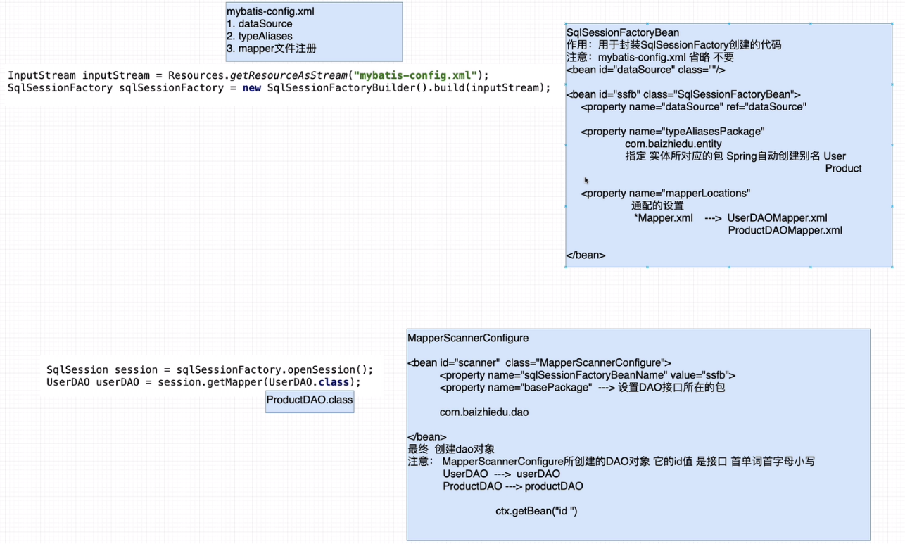

## Spring与MyBatis整合

### 1）MyBatis开发步骤的回顾

> 1. 实体
> 2. 实体别名
> 3. 表
> 4. 创建DAO接口
> 5. 实现Mapper文件
> 6. 注册Mapper文件
> 7. MyBatis的API调用

1. 实体

```java
public class User implements Serializable {
    private Integer id;
    private String name;
    private String password;

    public User() {
    }

    public User(Integer id, String name, String password) {
        this.id = id;
        this.name = name;
        this.password = password;
    }

    public Integer getId() {
        return id;
    }

    public void setId(Integer id) {
        this.id = id;
    }

    public String getName() {
        return name;
    }

    public void setName(String name) {
        this.name = name;
    }

    public String getPassword() {
        return password;
    }

    public void setPassword(String password) {
        this.password = password;
    }
}
```

2. 实体别名

```xml
<!--mybatis-config.xml-->
<typeAliases>
    <typeAlias alias="user" type="com.yhc.mybatis.User"></typeAlias>
</typeAliases>
```

3. 表

```mysql
+----------+-------------+------+-----+---------+----------------+
| Field    | Type        | Null | Key | Default | Extra          |
+----------+-------------+------+-----+---------+----------------+
| id       | int(11)     | NO   | PRI | NULL    | auto_increment |
| name     | varchar(12) | YES  |     | NULL    |                |
| password | varchar(12) | YES  |     | NULL    |                |
+----------+-------------+------+-----+---------+----------------+
```

4. 创建DAO接口

```java
public interface UserDAO {
    public void save(User user);
}
```

5. 实现Mapper文件

```xml
<!--UserDAOMapper.xml-->
<?xml version="1.0" encoding="UTF-8" ?>
<!DOCTYPE mapper
        PUBLIC "-//mybatis.org//DTD Config 3.0//EN"
        "http://mybatis.org/dtd/mybatis-3-mapper.dtd">

<mapper namespace="com.yhc.mybatis.UserDAO">
    <insert id="save" parameterType="user">
        insert into t_users(name, password) values (#{name}, #{password})
    </insert>
</mapper>
```

6. 注册Mapper文件

```xml
<!--mybatis-config.xml-->
<mappers>
    <mapper resource="UserDAOMapper.xml"/>
</mappers>
```

7. MyBatis的API调用

```java
public class TestMyBatis {
    public static void main(String[] args) throws IOException {
        InputStream inputStream = Resources.getResourceAsStream("mybatis-config.xml");
        SqlSessionFactory sqlSessionFactory = new SqlSessionFactoryBuilder().build(inputStream);
        SqlSession session = sqlSessionFactory.openSession();

        UserDAO userDAO = session.getMapper(UserDAO.class);

        User user = new User();
        user.setName("yhc");
        user.setPassword("123456");

        userDAO.save(user);

        session.commit();
    }
}
```

### 2）MyBatis在开发过程中存在的问题

> 配置繁琐(2.6步)  代码冗余(7步)

### 3）Spring与MyBatis整合思路分析



### 4）Spring与MyBatis整合的开发步骤

- 配置文件（ApplicationContext.xml）进行相关配置

  ```xml
  <!--连接池-->
  <bean id="dataSource" class=""/>
  
  <!--创建SqlSessionFactory-->
  <bean id="ssfb" class="SqlSessionFactoryBean">
  	<property name="dataSource" ref=""/>
      <property name="typeAliasesPackage">
      	指定 实体类所在的包
      </property>
      <property name="mapperLocations">
      	指定 配置文件(映射文件)的路径 还有通用配置
      </property>
  </bean>
  
  <!--DAO接口的实现类
  	session  ---  session.getMapper()  ---  XXXDAO实现类对象
  	XXXDAO  ---  xXXDAO
  -->
  <bean id="scanner" class="MapperScannerConfigure">
      <property name="sqlSessionFactoryBeanName" value="ssfb"/>
      <property name="basePackage">
      	指定 DAO接口放置的包 com.yhc.dao
      </property>
  </bean>
  ```

- 编码

  > 实战中经常根据需求 编写的代码
  >
  > 1. 实体
  > 2. 表
  > 3. 创建DAO接口
  > 4. 实现Mapper文件

### 5）Spring与MyBatis整合编码

#### 5.1）开发环境

```xml
<!--mybatis-->
<dependency>
  <groupId>org.mybatis</groupId>
  <artifactId>mybatis</artifactId>
  <version>3.4.6</version>
</dependency>

<!--mysql-->
<dependency>
  <groupId>mysql</groupId>
  <artifactId>mysql-connector-java</artifactId>
  <version>5.1.48</version>
</dependency>

<!--spring整合mybatis-->
<dependency>
  <groupId>org.springframework</groupId>
  <artifactId>spring-jdbc</artifactId>
  <version>5.1.14.RELEASE</version>
</dependency>

<dependency>
  <groupId>org.mybatis</groupId>
  <artifactId>mybatis-spring</artifactId>
  <version>2.0.2</version>
</dependency>

<!--连接池-->
<dependency>
  <groupId>com.alibaba</groupId>
  <artifactId>druid</artifactId>
  <version>1.1.18</version>
</dependency>
```

#### 5.2）配置文件

```xml
<!--连接池-->
<bean id="dataSource" class="com.alibaba.druid.pool.DruidDataSource">
    <property name="driverClassName" value="com.mysql.jdbc.Driver"/>
    <property name="url" value="jdbc:mysql://localhost:3306/yhc?useSSL=false"/>
    <property name="username" value="root"/>
    <property name="password" value="476004"/>
</bean>

<!--创建SqlSessionFactory-->
<bean id="ssfb" class="org.mybatis.spring.SqlSessionFactoryBean">
    <property name="dataSource" ref="dataSource"/>
    <property name="typeAliasesPackage" value="com.yhc.entity"/>
    <property name="mapperLocations">
        <list>
            <value>classpath:com.yhc.mapper/*Mapper.xml</value>
        </list>
    </property>
</bean>

<!--DAO接口的实现类
	session  ---  session.getMapper()  ---  XXXDAO实现类对象
	XXXDAO  ---  xXXDAO
-->
<bean id="scanner" class="org.mybatis.spring.mapper.MapperScannerConfigurer">
    <property name="sqlSessionFactoryBeanName" value="ssfb"/>
    <property name="basePackage" value="com.yhc.dao"/>
</bean>
```

#### 5.3）编码

> 1. 实体
> 2. 表
> 3. 创建DAO接口
> 4. 实现Mapper文件

### 6）Spring与MyBatis整合的细节

> 问题：Spring与MyBatis整合后，为什么DAO不提交事务，但是数据能够插入到数据库中？
>
> 本质上控制连接对象(Connection) ---> 连接池(dataSource)
>
> 1. MyBatis提供的连接池对象 ---> 创建Connection
>    - Connection.setAutoCommit(false)  手工的控制了事务，操作完成后，手工提交
> 2. Druid（C3P0、DBCP）作为连接池 ---> 创建Connection
>    - Connection.setAutoCommit(true) true为默认值，保持自动控制事务，自动提交
>
> 答案：因为Spring与MyBatis整合时，引入了外部连接池对象，保持自动的事务提交机制（Connection.setAutoCommit(true);），不需要手工进行事务的操作，也能进行事务的提交。
>
> 注意：未来实战中，仍会采用手工控制事务的机制（多条sql一起成功，一起失败），后续Spring通过事务控制解决这个问题。

