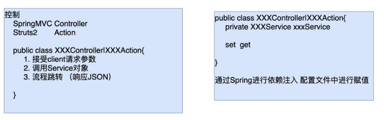

## 二十六、MCV框架整合思想

### 1）开发环境

```xml
<dependency>
  <groupId>junit</groupId>
  <artifactId>junit</artifactId>
  <version>4.11</version>
  <scope>test</scope>
</dependency>

<dependency>
  <groupId>javax.servlet</groupId>
  <artifactId>javax.servlet-api</artifactId>
  <version>3.1.0</version>
  <scope>provided</scope>
</dependency>

<dependency>
  <groupId>javax.servlet.jsp.jstl</groupId>
  <artifactId>jstl</artifactId>
  <version>1.2</version>
</dependency>

<dependency>
  <groupId>javax.servlet.jsp</groupId>
  <artifactId>javax.servlet.jsp-api</artifactId>
  <version>2.3.1</version>
  <scope>provided</scope>
</dependency>

<!--spring-->
<dependency>
  <groupId>org.springframework</groupId>
  <artifactId>spring-core</artifactId>
  <version>5.1.14.RELEASE</version>
</dependency>

<dependency>
  <groupId>org.springframework</groupId>
  <artifactId>spring-beans</artifactId>
  <version>5.1.14.RELEASE</version>
</dependency>

<dependency>
  <groupId>org.springframework</groupId>
  <artifactId>spring-web</artifactId>
  <version>5.1.14.RELEASE</version>
</dependency>

<dependency>
  <groupId>org.springframework</groupId>
  <artifactId>spring-context</artifactId>
  <version>5.1.14.RELEASE</version>
</dependency>

<dependency>
  <groupId>org.springframework</groupId>
  <artifactId>spring-aop</artifactId>
  <version>5.1.14.RELEASE</version>
</dependency>

<dependency>
  <groupId>org.springframework</groupId>
  <artifactId>spring-jdbc</artifactId>
  <version>5.1.14.RELEASE</version>
</dependency>

<dependency>
  <groupId>org.springframework</groupId>
  <artifactId>spring-tx</artifactId>
  <version>5.1.14.RELEASE</version>
</dependency>

<!--log4j-->
<dependency>
  <groupId>log4j</groupId>
  <artifactId>log4j</artifactId>
  <version>1.2.17</version>
</dependency>

<dependency>
  <groupId>org.slf4j</groupId>
  <artifactId>slf4j-log4j12</artifactId>
  <version>1.7.25</version>
  <scope>test</scope>
</dependency>

<!--aop-->
<dependency>
  <groupId>org.aspectj</groupId>
  <artifactId>aspectjweaver</artifactId>
  <version>1.8.12</version>
</dependency>

<dependency>
  <groupId>org.aspectj</groupId>
  <artifactId>aspectjrt</artifactId>
  <version>1.8.12</version>
</dependency>

<!--mybatis-->
<dependency>
  <groupId>org.mybatis</groupId>
  <artifactId>mybatis</artifactId>
  <version>3.4.6</version>
</dependency>

<dependency>
  <groupId>org.mybatis</groupId>
  <artifactId>mybatis-spring</artifactId>
  <version>2.0.2</version>
</dependency>

<!--数据库-->
<dependency>
  <groupId>mysql</groupId>
  <artifactId>mysql-connector-java</artifactId>
  <version>5.1.48</version>
</dependency>

<!--连接池-->
<dependency>
  <groupId>com.alibaba</groupId>
  <artifactId>druid</artifactId>
  <version>1.1.18</version>
</dependency>
```

### 2）为什么要整合MVC框架

> 1. MVC框架提供了控制器（Controller）调用Service
>
>    DAO -> Service -> Controller
>
> 2. 请求响应的处理
> 3. 接收请求参数    request.getParameter("")
> 4. 控制程序的运行流程
> 5. 视图解析（JSP JSON Freemarker Thyemeleaf）

### 3）Spring可以整合哪些MCV框架

> 1. struts1
> 2. webwork
> 3. jsf
> 4. struts2
> 5. springMVC

### 4）Spring整合MVC框架的核心思路

#### 4.1）准备工厂

> 1. Web开发过程中如何创建工厂
>
>    ApplicationContext ctx = new WebXmlApplicationContext();
>
> 2. 如何保证工厂唯一且同时可以被共用
>
>    被共用：Web作用域 request | session | ServletContext(application)
>
>    工厂存储在ServletContext这个作用域中 ServletContext.setAttribute("xxxxx", ctx);
>
>    唯一：ServletContext对象创建的同时 -> 创建Spring工厂
>
>    ​			  ServletContextListener -> ApplicationContext ctx = new WebXmlApplicationContext();
>
>    ​			  ServletContextListener 在 ServletContext对象创建的同时，被调用（只会被调用一次），把工厂创建的代码，写在ServletContextListener中，也会保证只调用一次，最终工厂就保证了唯一性。
>
> 3. 总结
>
>    ServletContextListener (解决唯一问题)
>
>    - ApplicationContext ctx = new WebXmlApplicationContext();
>    - ServletContext.setAttribute("xxxx", ctx);（解决共用问题）
>
> 4. Spring封装了一个ContextLoaderListener
>    - 创建工厂
>    - 把工厂存在ServletContext中

> ContextLoaderListener使用方式
>
> web.xml
>
> ```xml
> <listener>
> 	<listener-class>org.springframework.web.contex.ContextLoaderListener</listener-class>
> </listener>
> 
> <context-param>
> 	<param-name>contextConfigLocation</param-name>
>     <param-value>classpath:applicationContext.xml</param-value>
> </context-param>
> ```

#### 4.2）代码整合

依赖注入：把Service对象注入给控制器对象

