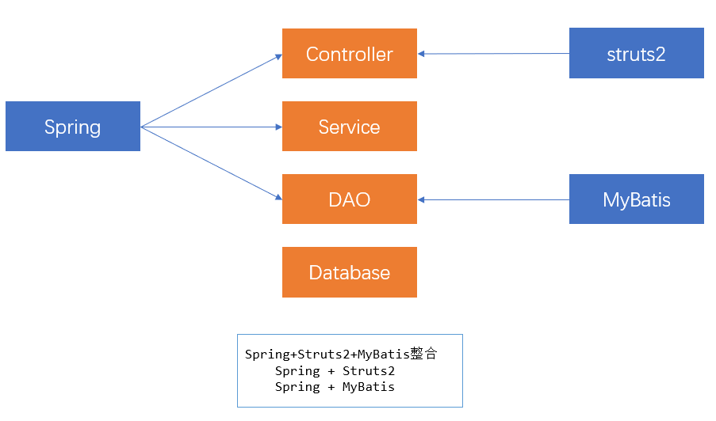

## 二十八、Spring+Struts2+MyBatis整合（SSM）

### 1）思路分析



### 2）整合编码

#### 2.1）搭建开发环境

1. 引入相关jar包（Spring、Struts2、MyBatis）

   ```xml
   <!--Struts2-->
   <dependency>
       <groupId>org.apache.struts</groupId>
       <artifactId>struts2-spring-plugin</artifactId>
       <version>2.3.8</version>
   </dependency>
   
   <!--MyBatis-->
       <dependency>
       <groupId>org.mybatis</groupId>
       <artifactId>mybatis</artifactId>
       <version>3.4.6</version>
   </dependency>
   <dependency>
       <groupId>org.mybatis</groupId>
       <artifactId>mybatis-spring</artifactId>
       <version>2.0.2</version>
   </dependency>
   <dependency>
       <groupId>mysql</groupId>
       <artifactId>mysql-connector-java</artifactId>
       <version>5.1.48</version>
   </dependency>
   <dependency>
       <groupId>com.alibaba</groupId>
       <artifactId>druid</artifactId>
       <version>1.1.18</version>
   </dependency>
   
   <!--Spring-->
   <dependency>
       <groupId>org.springframework</groupId>
       <artifactId>spring-core</artifactId>
       <version>5.1.14.RELEASE</version>
   </dependency>
   <dependency>
       <groupId>org.springframework</groupId>
       <artifactId>spring-beans</artifactId>
       <version>5.1.14.RELEASE</version>
   </dependency>
   <dependency>
       <groupId>org.springframework</groupId>
       <artifactId>spring-web</artifactId>
       <version>5.1.14.RELEASE</version>
   </dependency>
   <dependency>
       <groupId>org.springframework</groupId>
       <artifactId>spring-context</artifactId>
       <version>5.1.14.RELEASE</version>
   </dependency>
   <dependency>
       <groupId>org.springframework</groupId>
       <artifactId>spring-aop</artifactId>
       <version>5.1.14.RELEASE</version>
   </dependency>
   <dependency>
       <groupId>org.springframework</groupId>
       <artifactId>spring-jdbc</artifactId>
       <version>5.1.14.RELEASE</version>
   </dependency>
   <dependency>
       <groupId>org.springframework</groupId>
       <artifactId>spring-tx</artifactId>
       <version>5.1.14.RELEASE</version>
   </dependency>
   
   <!--junit test-->
   <dependency>
       <groupId>junit</groupId>
       <artifactId>junit</artifactId>
       <version>4.11</version>
       <scope>test</scope>
   </dependency>
   
   <!--Web 相关-->
   <dependency>
       <groupId>javax.servlet</groupId>
       <artifactId>javax.servlet-api</artifactId>
       <version>3.1.0</version>
       <scope>provided</scope>
   </dependency>
   <dependency>
       <groupId>javax.servlet.jsp.jstl</groupId>
       <artifactId>jstl</artifactId>
       <version>1.2</version>
   </dependency>
   <dependency>
       <groupId>javax.servlet.jsp</groupId>
       <artifactId>javax.servlet.jsp-api</artifactId>
       <version>2.3.1</version>
       <scope>provided</scope>
   </dependency>
   
   <!--log4j 日志-->
   <dependency>
       <groupId>log4j</groupId>
       <artifactId>log4j</artifactId>
       <version>1.2.17</version>
   </dependency>
   <dependency>
       <groupId>org.slf4j</groupId>
       <artifactId>slf4j-log4j12</artifactId>
       <version>1.7.25</version>
       <scope>test</scope>
   </dependency>
   
   <!--AOP 面向切面编程-->
   <!--aspectj-->
   <dependency>
       <groupId>org.aspectj</groupId>
       <artifactId>aspectjweaver</artifactId>
       <version>1.8.12</version>
   </dependency>
   <dependency>
       <groupId>org.aspectj</groupId>
       <artifactId>aspectjrt</artifactId>
       <version>1.8.12</version>
   </dependency>
   ```

2. 引入对应的配置文件

   - Spring相关 -> applicationContext.xml
   - struts2相关 -> struts.xml
   - MyBatis相关 -> xxxMapper.xml
   - 日志相关 -> log4j.properties

3. 初始化配置

   - Spring相关 -> 工厂创建（ContextLoaderListener -> web.xml）
   - Struts2（Filter -> web.xml）

   ```xml
   <listener>
       <listener-class>
           org.springframework.web.context.ContextLoaderListener
       </listener-class>
   </listener>
   
   <context-param>
       <param-name>contextConfigLocation</param-name>
       <param-value>classpath:applicationContext.xml</param-value>
   </context-param>
   
   <filter>
       <filter-name>struts2</filter-name>
       <filter-class>
           org.apache.struts2.dispatcher.ng.filter.StrutsPrepareAndExecuteFilter
       </filter-class>
   </filter>
   <filter-mapping>
       <filter-name>struts2</filter-name>
       <url-pattern>/*</url-pattern>
   </filter-mapping>
   ```

#### 2.2）编码

- DAO层（Spring + MyBatis）
- Service层（Spring添加事务）
- Controller层（Spring + Struts2）

### 3）Spring开发过程中多配置文件的处理

> Spring会根据需要，把配置信息分门别类的放置在多个配置文件中，便于后续的维护及管理
>
> DAO  ----->  applicationContext-dao.xml
>
> Service  ----->  applicationContext-service.xml
>
> Action  ----->  applicationContext-action.xml
>
> 注意：虽然提供了多个配置文件，但是后续应用的过程中，还要进行整合

- 通配符方式

  - 非Web环境

    - ApplicationContext ctx = new ClassPathXmlApplicationContext("/applicationContext-*.xml");

  - Web环境

    ```xml
    <context-param>
        <param-name>contextConfigLocation</param-name>
        <param-value>classpath:applicationContext-*.xml</param-value>
    </context-param>
    ```

- import标签

  - 主配置文件 application.xml 目的 整合其他配置文件

    ```xml
    <import resources="applicationContext-dao.xml"/>
    <import resources="applicationContext-service.xml"/>
    <import resources="applicationContext-action.xml"/>
    ```