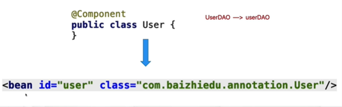
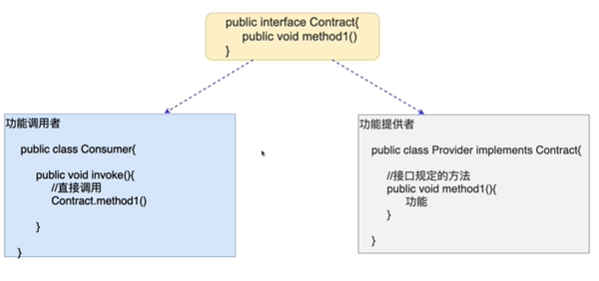
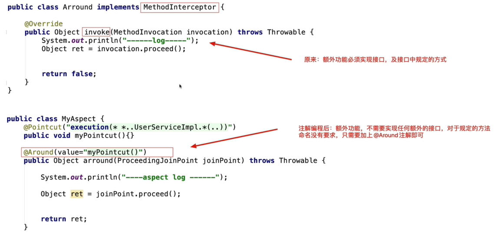

## 二十九、注解基础概念

### 1）什么是注解编程

> 指的是在类或者方法上加入特定的注解（@XXX），完成特定功能的开发。

### 2）为什么要讲解注解编程

> 1. 注解开发方便
>    - 代码简洁、开发速度大大提高
>
> 2. Spring开发潮流
>    - Spring2.x引入注解
>    - Spring3.x完善注解
>    - SpringBoot普及 推广注解编程

### 3）注解的作用

> 1. 替换XML这种配置形式，简化配置
>
>    
>
> 2. 替换接口，实现调用双方的契约性
>
>    - 接口的契约性
>
>    
>
>    - 注解的契约性
>
>      通过注解的方式，在功能调用者和功能提供者之间达成约定，进而进行功能的调用。因为注解应用更为方便灵活，所以在现在开发中，更推荐通过注解的形式完成。
>
>    

### 4）Spring注解的发展历程

> - Spring2.x 开始支持注解编程  @Component  @Service  @Scope
>   - 目的：提供的这些注解只是为了在某些情况下简化XML的配置，作为XML开发的有益补充
> - Spring3.x @Configuration  @Bean
>   - 目的：彻底替换XML，基于纯注解编程
> - Spring4.x SpringBoot
>   - 提倡使用注解进行开发

### 5）Spring注解开发的一个问题

> Spring基于注解进行配置后，还能否解耦合呢？
>
> 在Spring框架应用注解时，如果对注解配置的内容不满意，可以通过Spring配置文件进行覆盖的。