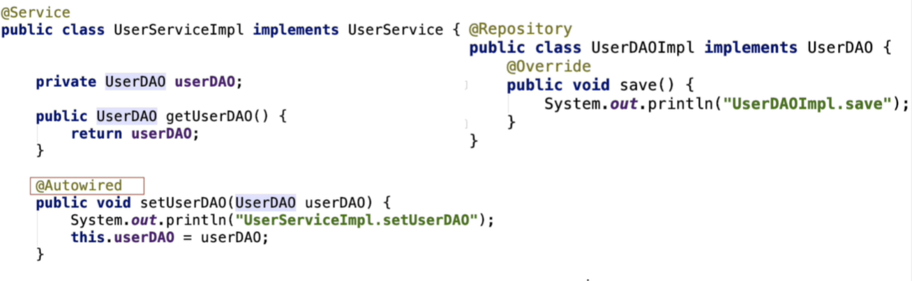
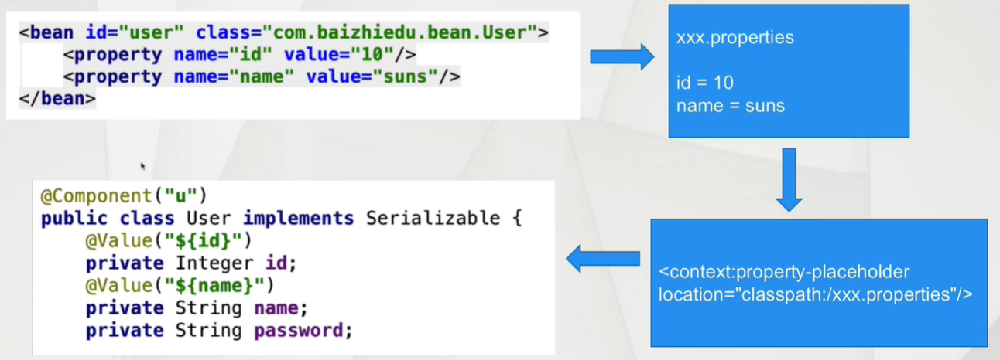

## 三十、Spring的基础注解（Spring2.x）

> 这个阶段的注解，仅仅是简化XML的配置，并不能完全替代XML

### 1）对象创建相关的注解

#### 1.1）搭建开发环境

```xml
<context:component-scan base-package="包名"/>
作用：让Spring框架在设置的包及其子包中扫描对应的注解，使其生效
```

### 1.2）创建对象相关注解

#### @Component

> 作用：替换原有Spring配置文件中的<bean>标签
>
> id默认值：类名首单词首字母小写
>
> class属性：可以通过反射技术获得
>
> 细节：
>
> 1. 如何显示指定工厂创建对象的id值  ->  @Component("u")
>
> 2. Spring配置文件覆盖注解的配置内容
>
> ```xml
> <bean id="与@Component设置一致" class=""/>
> ```

#### @Component的衍生注解

> @Repository -> 建议应用在DAO类上
>
> @Service -> 建议应用在Service类上
>
> @Controller -> 建议应用在Controller类上
>
> 目的：更加准确的表达一个类型的作用
>
> 注意：本质上这些衍生注解就是@Component
>
> - 作用与<bean>标签和@Component一致
> - Spring整合MyBatis开发过程中，不使用@Component和@Repository，因为Spring整合MyBatis开发过程不创建DAO类

#### @Scope注解

> 作用：用于控制简单对象的创建次数，与<bean>标签的scope属性效果一致
>
> 默认值为：singleton

#### @Lazy注解

> 作用：延迟创建单实例对象，与<bean>标签的lazy属性效果一致
>
> 注意：一旦使用了@Lazy注解后，Spring会在使用这个对象的时候，进行这个对象的创建

#### 生命周期相关的注解

> 1. 初始化相关方法  @PostConstruct
>    - InitializingBean
>    - <bean init-method=""/>
> 2. 销毁相关方法  @PreDestroy
>    - DisposableBean
>    - <bean destory-method=""/>
>
> 注意：上述的2个注解并不是Spring提供的，是JSR（JavaEE规范）520提供的
>
> ​				再一次的验证了，通过注解实现了接口的契约性

### 1.3）注入相关注解

#### 用户自定义类型的注入 @AutoWired



> 1. @AutoWired 是基于类型的注入 【推荐】
>
>    注入对象的类型，必须与目标成员变量类型相同或者是其子类（实现类）
>
> 2. @AutoWired @Qualifier配合使用达成基于名字注入的效果 【了解】
>
>    注入对象的id值，不许与 Qualifier注解中设置的名字相同
>
> 3. @AutoWired注解放置位置
>
>    - 放置在对应成员变量的set方法上，调用set方法对成员变量进行注入（赋值）
>    - 放置在成员变量之上，Spring通过反射直接对成员变量进行注入（赋值），不再调用set方法 【推荐】
>
> 4. JavaEE规范中提供了类似功能的注解
>
>    - JSR250 @Resource(name="")基于名字进行注入 <=> @AutoWired + @Qualifier
>
>      若没有指定name属性，@Resource会按照类型进行注入
>
>    - JSR330 @Inject  <=> @AutoWired 作用完全一致 基于类型进行注入
>
>      需要引入相关jar包
>
>      ```xml
>      <!-- https://mvnrepository.com/artifact/javax.inject/javax.inject -->
>      <dependency>
>          <groupId>javax.inject</groupId>
>          <artifactId>javax.inject</artifactId>
>          <version>1</version>
>      </dependency>
>      ```

#### JDK类型的注入



> @Value 注解完成
>
> 1. 配置 xxx.properties，通过键值对存储
>
> 2. Spring的工厂读取这个配置文件
>
>    ```xml
>    <context:property-placeholder location="init.properties"/>
>    ```
>
> 3. 代码书写 @Value("${key}")

> @PropertySource
>
> 1. 作用：用于替换Spring配置文件中的<context:property-placeholder location="init.properties"/>
> 2. 开发步骤
>    - 配置 xxx.properties，通过键值对存储
>    - 应用@PropertySource注解
>    - 代码书写 @Value("${key}")

> 1. @Value注解不能应用在静态变量上，如果应用，赋值（注入）失败
>
> 2. @Value注解 + @Properties这种方式不能为集合类型赋值（注入）
>
>    Spring提供新的配置形式 YAML YML （SpringBoot中的配置形式）

### 2）注解扫描详解

```xml
<context:component-scan base-package="包名"/>
作用：让Spring框架在设置的包及其子包中扫描对应的注解，使其生效
Spring提供了更细粒度的扫描方式
```

#### 2.1）排除方式

```xml
<context:component-scan base-package="包名">
	<context:exclude-filter type="" expression=""/>
</context:component-scan>

type: assignable：排除特定的类型，不进行扫描
	  annotation：排除特定的注解，不进行扫描
	  aspectj: 切入点表达式，只支持包切入点和类切入点
	  regex: 正则表达式
	  custom: 自定义排除策略，应用在框架底层开发

排除策略可以叠加使用
```

#### 2.2）包含方式

```xml
<context:component-scan base-package="包名" use-default-filters="false">
	<context:include-filter type="" expression=""/>
</context:component-scan>

1. use-default-filters="false"
	作用：让Spring默认的注解扫描方式失效。
2. <context:include-filter type="" expression=""/>
	作用：指定扫描哪些注解
	type同排除方式type，但语义相反

包含策略也可以叠加使用
```

### 3）对于注解开发的思考

- 配置互通

  > Spring注解配置 配置文件配置 互通
  >
  > 注解配置创建的对象可以引用配置文件配置创建的对象，反之亦然。

- 什么情况下使用注解，什么情况下使用配置文件

  > @Component 替换 <bean>标签
  >
  > 基础注解（@Component @AutoWired @Value）程序员开发类型的配置
  >
  > 1. 在程序员开发的类型上，可以加入对应注解，进行对象的创建
  >
  >    User、UserServiceImpl、UserDAOImpl、UserAction
  >
  > 2. 应用其他非程序员开发的类型时，还时需要使用<bean>标签进行配置
  >
  >    SqlSessionFactoryBean、MapperScannerConfigure

### 4）SSM整合开发（半注解开发）