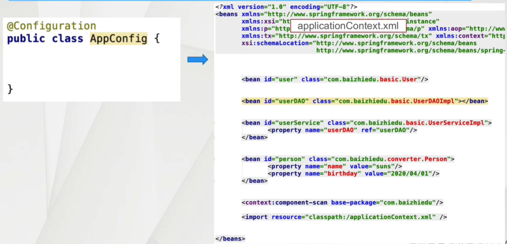
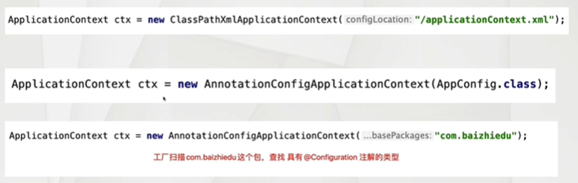
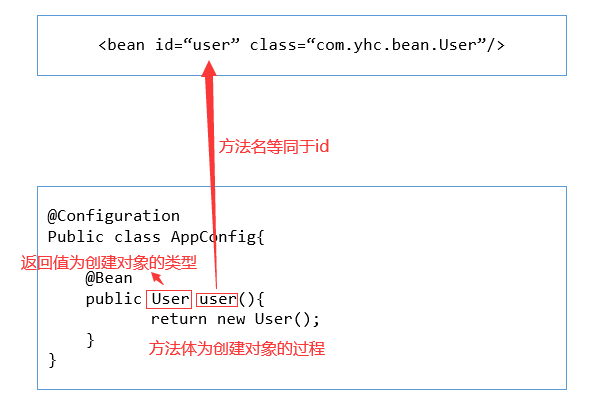
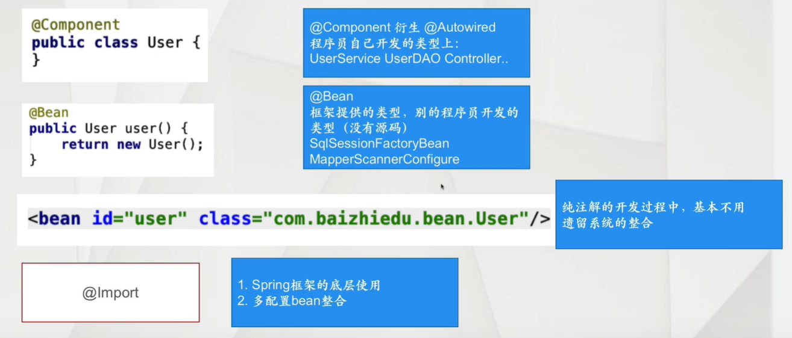
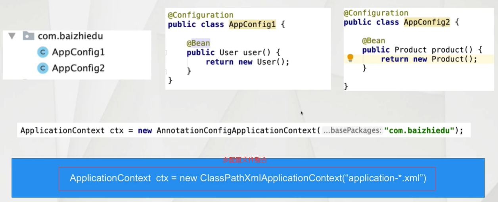
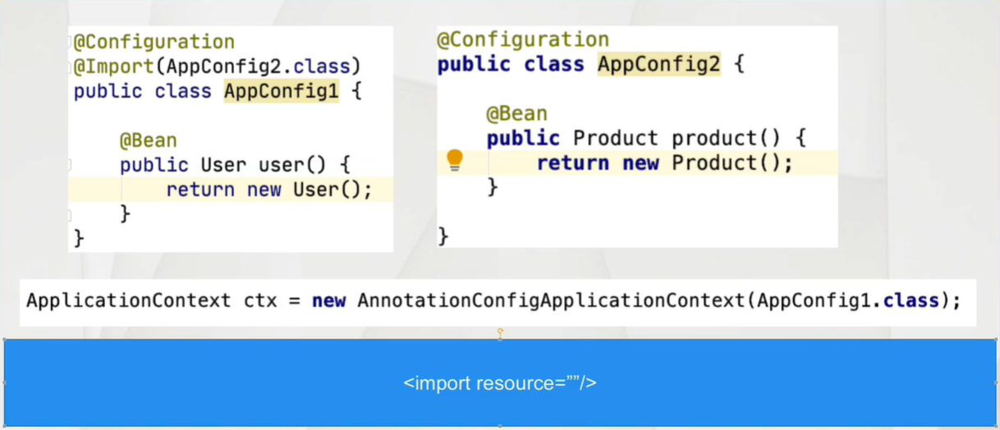
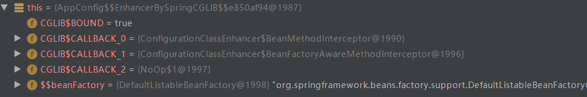

## 三十一、Spring的高级注解（Spring3.x及以上）

### 1）配置Bean

> Spring在3.x提供的新的注解，用于替换XML配置文件。
>
> ```java
> @Configuration
> public class AppConfig{
>     
> }
> ```
>
> 1. 配置Bean在应用的过程中替换了XML具体什么内容呢？
>
>    
>
> 2. 配置Bean工厂发生变化
>
>    

- 配置Bean开发的细节分析

  - 基于注解开发使用日志

    > 不能集成Log4j
    >
    > 集成logback
    >
    > - 引入相关jar包
    >
    >   ```xml
    >   <!--logback-->
    >   <dependency>
    >     <groupId>org.slf4j</groupId>
    >     <artifactId>slf4j-api</artifactId>
    >     <version>1.7.25</version>
    >   </dependency>
    >   
    >   <dependency>
    >     <groupId>org.slf4j</groupId>
    >     <artifactId>jcl-over-slf4j</artifactId>
    >     <version>1.7.25</version>
    >   </dependency>
    >   
    >   <dependency>
    >     <groupId>org.logback-extensions</groupId>
    >     <artifactId>logback-ext-spring</artifactId>
    >     <version>0.1.4</version>
    >   </dependency>
    >   
    >   <dependency>
    >     <groupId>ch.qos.logback</groupId>
    >     <artifactId>logback-core</artifactId>
    >     <version>1.2.3</version>
    >   </dependency>
    >   
    >   <dependency>
    >     <groupId>ch.qos.logback</groupId>
    >     <artifactId>logback-classic</artifactId>
    >     <version>1.2.3</version>
    >     <scope>test</scope>
    >   </dependency>
    >   ```
    >
    > - 引入logback配置文件
    >
    >   ```xml
    >   <?xml version="1.0" encoding="UTF-8" ?>
    >   <configuration>
    >       <!--控制台输出-->
    >       <appender name="STDOUT" class="ch.qos.logback.core.ConsoleAppender">
    >           <encoder>
    >               <!--格式化输出-->
    >               <pattern>%d{yyyy-MM-dd HH:mm:ss} [%thread] %-5level %logger{50} - %msg%n</pattern>
    >           </encoder>
    >       </appender>
    >   
    >       <root level="DEBUG">
    >           <appender-ref ref="STDOUT"/>
    >       </root>
    >   </configuration>
    >   ```
    
  - @Configuration注解的本质
  
    > @Configuration也是@Component注解的衍生注解
    >
    > 可以应用<context:component-scan  >进行扫描

### 2）@Bean注解

> @Bean注解在配置Bean中进行使用，等同于XML配置文件中的\<bean>标签

#### 2.1）@Bean注解的基本使用

- 对象的创建

  > 1. 简单对象
  >
  >    直接能够通过new方式创建的对象
  >
  >    User、UserService、UserDAO
  >
  > 2. 复杂对象
  >
  >    不能通过new方式直接创建的对象
  >
  >    Connection、SqlSessionFactory



- @Bean注解创建复杂对象的注意事项

```java
// 用于遗留系统
// 整合FactoryBean
@Bean
public Connection conn(){
    ConnectionFactoryBean connectionFactoryBean = new ConnectionFactoryBean();
    Connection connection = null;
    try {
        connection = connectionFactoryBean.getObject();
    } catch (Exception e) {
        e.printStackTrace();
    }
    return connection;
}
```

- 自定义id值

```java
@Bean("id") 在@Bean注解中增加参数即可
```

- 控制对象创建次数

```java
@Bean("id")
@Scope("singleton")  增加@Scope注解，默认值为singleton
```

#### 2.2）@Bean注解的注入

- 用户自定义类型

  ```java
  @Bean
  public UserDAO userDAO(){
      return new UserDAOImpl();
  }
  
  @Bean
  public UserService userService(UserDAO userDAO){
      UserServiceImpl userService = new UserServiceImpl();
      userService.setUserDAO(userDAO);
      return userService;
  }
  ```

  ```java
  // 简化写法
  // 不需要把DAO作为形参
  // set方法中直接调用userDAO方法
  @Bean
  public UserDAO userDAO(){
      return new UserDAOImpl();
  }
  @Bean
  public UserService userService(){
      UserServiceImpl userService = new UserServiceImpl();
      userService.setUserDAO(userDAO());
      return userService;
  }
  ```

- JDK类型的注入

  ```java
  @Bean
  public Category category(){
      Category category = new Category();
      category.setId(10);
      category.setName("yhc");
      return category;
  }
  ```

  - JDK类型注入的细节分析

    如果直接在代码中进行set方法的调用，会存在耦合的问题

    ```properties
    # category.properties
    id = 2
    name = yhc
    ```

    ```java
    @Configuration
    @PropertySource("category.properties")
    public class AppConfig1 {
    
        @Value("${id}")
        private Integer id;
        @Value("${name}")
        private String name;
        
        @Bean
        public Category category(){
            Category category = new Category();
            category.setId(id);
            category.setName(name);
            return category;
        }
    }
    ```

### 3）@ComponentScan注解

> @ComponentScan注解在配置bean中进行使用，等同于XML配置文件中的<context:component-scan >标签
>
> 目的：进行相关注解的扫描（@Component @Value ... @AutoWired）

#### 3.1）基本使用

```java
@Configuration
@ComponentScan(basePackages = "com.yhc.scan")
public class AppConfig {
}
```

#### 3.2）排除、包含的使用

- 排除策略

  ```xml
  <context:component-scan base-package="com.yhc">
      <!--排除策略-->
      <context:exclude-filter type="" expression=""/>
  </context:component-scan>
  ```

  ```java
  type = FilterType.ANNOTATION        value
      			 .ASSIGNABLE_TYPE   value
      			 .ASPECTJ           pattern
      			 .REGEX             pattern
      			 .CUSTOM            value
  
  @ComponentScan(basePackages = "com.yhc.scan",
      excludeFilters = {
          @ComponentScan.Filter(type=FilterType.ANNOTATION, value={Service.class}),
          @ComponentScan.Filter(type=FilterType.ASPECTJ, pattern={"*..User1"})
      }
  )
  ```

- 包含策略

  ```xml
  <context:component-scan base-package="com.yhc" use-default-filters="false">
      <!--包含策略-->
      <context:include-filter type="" expression=""/>
  </context:component-scan>
  ```

  ```java
  @ComponentScan(basePackages = "com.yhc.scan", useDefaultFilters = false,
      includeFilters = {
          @ComponentScan.Filter(type=FilterType.ANNOTATION, value={Service.class})
      }
  )
  ```

### 4）Spring工厂创建对象的多种配置方式

#### 4.1）多种配置方式的应用场景



#### 4.2）配置优先级

> @Component及其衍生注解 < @Bean < 配置文件bean标签
>
> 优先级高的配置 覆盖优先级低的配置
>
> ```java
> @Component
> public class User{}
> 
> @Bean
> public User user(){
>     return new User();
> }
> 
> <bean id="user" class="xxx.User">
> ```
>
> 配置覆盖：id值必须保持一致

- 解决基于注解配置中产生耦合的问题

  > 利用配置文件覆盖@Bean注解

### 5）整合多个配置信息

> - 为什么会有多个配置信息
>
>   拆分多个配置bean的开发，是一种模块化开发的形式，也体现了面向对象各司其职的设计思想
>
> - 多配置信息整合的方式
>   - 多配置bean整合
>   - 配置bean与@Component相关注解的整合
>   - 配置bean与配置文件(Spring XML)的整合
>     - 配置覆盖
>     - 遗留系统的整合
>
> - 整合多种配置需要关注哪些要点
>   - 如何使多配置的信息汇总成一个整体
>   - 跨配置注入

#### 5.1）多个配置Bean的整合

- 如何使多配置的信息汇总成一个整体

  - 基于base-package进行多个配置bean的整合

  

  - 基于@Import注解进行多个配置bean的整合
    - 可以用于创建对象
    - 多配置bean的整合

  

  - 在工厂创建时，指定多个配置Bean的Class对象

  ```java
  ApplicationContext ctx = new AnnotationConfigApplicationContext(AppConfig1.class, AppConfig2.class, ...);
  ```

- 跨配置注入

  > 1. 将需要注入的对象作为成员变量
  >
  > 2. 为该成员变量添加@AutoWired注解
  >
  > 在应用配置bean的过程中，不管使用哪种方式进行配置信息的汇总，其操作方式都是通过成员变量 + @AutoWired注解完成的

#### 5.2）配置bean与@Component相关注解的整合

> 配置bean中增加@ComponentScan即可

#### 5.3）配置bean与配置文件(Spring XML)的整合

> - 配置覆盖
> - 遗留系统的整合
>
> 配置bean中增加@ImportResource(".xml文件路径")即可

### 6）配置Bean底层实现原理

> Spring在配置bean中加入了@Configuration注解后，底层就会通过CGlib的代理方式，来进行对象相关的配置、处理
>
> 

### 7）四维一体的开发思想

#### 7.1）什么是四维一体

> Spring开发一个功能的4种形式，虽然开发方式不同，但是最终效果是一样的。
>
> 1. 基于schema
> 2. 基于特定功能注解
> 3. 基于原始\<bean>
> 4. 基于@Bean注解

#### 7.2）四维一体的开发案例

properties文件属性值注入

```java
public class Account implements Serializable {

    @Value("${id}")
    private Integer id;
    @Value("${name}")
    private String name;

    public Integer getId() {
        return id;
    }

    public void setId(Integer id) {
        this.id = id;
    }

    public String getName() {
        return name;
    }

    public void setName(String name) {
        this.name = name;
    }

    @Override
    public String toString() {
        return "Account{" +
                "id=" + id +
                ", name='" + name + '\'' +
                '}';
    }
}
```

1. 基于schema

```xml
<context:property-placeholder location="four.properties"/>
```

2. 基于特定功能注解【推荐】

```java
@Component
@PropertySource("four.properties")
public class Account implements Serializable {
    ......
}
```

3. 基于原始\<bean>

```xml
<bean id="propertyHolder" class="org.springframework.context.support.PropertySourcesPlaceholderConfigurer">
    <property name="location" value="four.properties"/>
</bean>
```

4. 基于@Bean注解【推荐】

```java
@Configuration
@ComponentScan(basePackages = "com.yhc.four")
public class ApplicationConfig {

    @Bean
    public PropertySourcesPlaceholderConfigurer configurer(){
        PropertySourcesPlaceholderConfigurer configurer = new PropertySourcesPlaceholderConfigurer();
        configurer.setLocation(new ClassPathResource("four.properties"));
        return  configurer;
    }
}
```

### 8）纯注解版AOP编程

#### 8.1）搭建环境

- 应用配置bean
- 注解扫描

```java
@Configuration
@ComponentScan(basePackages = "com.yhc.aop")
public class AppConfig {
    
}
```

#### 8.2）开发步骤

1. 原始对象

   ```java
   public class UserServiceImpl implements UserService {
   
       @Override
       public void register() {
           System.out.println("UserServiceImpl.register");
       }
   }
   ```

2. 创建切面类（额外功能 -> 切入点 -> 组装切面）

   ```java
   /*
       切面类 = 额外功能 + 切点
       1. 额外功能
           public class MyAround implements MethodInterceptor{
               public Object invoke(MethodInvocation invocation){
   
                   Object ret = invocation.proceed();
   
                   return ret;
               }
           }
       2. 切入点
           <aop:config>
               <aop:pointcut id="pc" expression="execution(* *(..))" />
           <aop:config/>
   
    */
   @Aspect
   @Component
   public class MyAspect {
   
       @Pointcut("execution(* *..UserServiceImpl.*(..))")
       public void myPointCut(){}
   
       @Around(value = "myPointCut()")
       public Object arround(ProceedingJoinPoint joinPoint){
   
           System.out.println("--before--");
           Object ret = null;
           try {
               ret = joinPoint.proceed();
           } catch (Throwable throwable) {
               throwable.printStackTrace();
           }
   
           return  ret;
       }
   
       @Around(value = "myPointCut()")
       public Object arround1(ProceedingJoinPoint joinPoint){
   
           Object ret = null;
           try {
               ret = joinPoint.proceed();
           } catch (Throwable throwable) {
               throwable.printStackTrace();
           }
           System.out.println("--after--");
   
           return  ret;
       }
   }
   ```

3. 配置

   - 原配置文件配置

   ```xml
   <!--告知Spring基于注解进行AOP编程-->
   <aop:aspectj-autoproxy />
   ```

   - 配置bean配置

   ```java
   @Configuration
   @ComponentScan(basePackages = "com.yhc.aop")
   @EnableAspectJAutoProxy
   public class AppConfig {
       
   }
   ```

#### 8.3）注解AOP细节分析

> 1. 代理创建方式的切换 JDK CGlib
>
>    ```xml
>    <aop:aspectj-autoproxy proxy-target-class="true|false"/>
>    ```
>
>    ```java
>    @EnableAspectJAutoProxy(proxyTargetClass = true)
>    ```
>
> 2. SpringBoot Aop的开发方式
>
>    只需要做前两步开发，第三步@EnableAspectJAutoProxy注解SpringBoot已经配置好了
>
>    Spring AOP代理默认实现是JDK
>
>    SpringBoot AOP代理默认实现是CGlib